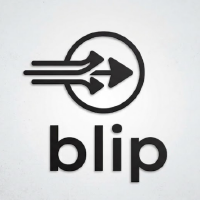
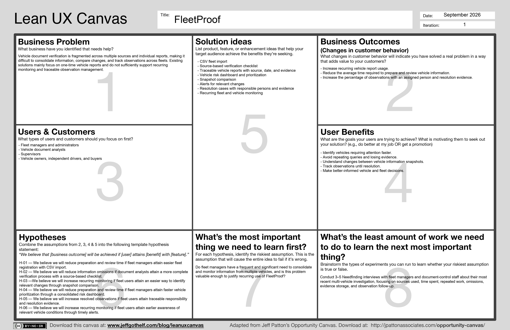

# Capítulo I: Introducción

## 1.1. Startup Profile

BLIP es una startup tecnológica orientada al desarrollo de productos digitales que buscan simplificar procesos complejos y facilitar la gestión de información relevante para personas y organizaciones. La startup identifica necesidades presentes en procesos que requieren consultar, organizar y dar seguimiento a información proveniente de diferentes fuentes, y las transforma en soluciones digitales centradas en el usuario.

Dentro de este enfoque, BLIP desarrolla FleetProof, un producto digital orientado al seguimiento del estado documentario y administrativo de vehículos y flotas. La propuesta busca facilitar la transformación de consultas puntuales e información dispersa en una experiencia organizada que permita conocer, comparar y dar seguimiento al estado de las unidades.

### 1.1.1. Descripción de la Startup

**Propósito:**

El propósito de BLIP es desarrollar soluciones tecnológicas que simplifiquen procesos complejos y reduzcan el tiempo, esfuerzo e incertidumbre que enfrentan las personas y organizaciones en sus actividades cotidianas. Para ello, la startup busca identificar problemas concretos y transformarlos en experiencias digitales que faciliten la gestión de información y la toma de decisiones.

**Misión:**

La misión de BLIP es crear productos digitales innovadores, accesibles y confiables que permitan a personas y organizaciones gestionar información y procesos de manera más eficiente, contribuyendo a una toma de decisiones más informada y orientada a sus necesidades.

**Visión:**

La visión de BLIP es consolidarse como una startup tecnológica reconocida por desarrollar soluciones digitales innovadoras que transformen procesos tradicionales mediante experiencias centradas en las necesidades de sus usuarios y que generen valor sostenible.

**Propuesta de valor:**

La propuesta de valor de BLIP se basa en identificar necesidades reales y convertir procesos que actualmente pueden involucrar tareas manuales, información dispersa o consultas aisladas en experiencias digitales simples, organizadas y orientadas al usuario.

La startup busca generar valor mediante productos tecnológicos que reduzcan tareas innecesarias, centralicen información relevante y faciliten el seguimiento de procesos y situaciones que requieren atención. Su propuesta combina tecnología, innovación y comprensión de las necesidades de los usuarios para desarrollar productos útiles, escalables y capaces de evolucionar de acuerdo con las necesidades identificadas.

En este marco, FleetProof representa la aplicación de esta propuesta al ámbito de la gestión vehicular, buscando facilitar el seguimiento del estado documentario y administrativo de vehículos y flotas mediante información organizada, trazable y orientada a la toma de decisiones.

**Modelo de Negocio:**

BLIP plantea un modelo de negocio basado en el desarrollo y comercialización de productos digitales propios, buscando generar ingresos de manera independiente y sostenible sin depender exclusivamente de proyectos personalizados o de terceros.

La startup apuesta por modelos digitales escalables, en los que sus productos puedan atender progresivamente a un mayor número de usuarios sin que los costos de operación aumenten proporcionalmente. Asimismo, busca establecer fuentes de ingresos recurrentes, como suscripciones y otros servicios digitales, que permitan financiar el mantenimiento, evolución y expansión de sus productos.

Este enfoque permite que BLIP desarrolle productos propios con capacidad de crecimiento progresivo y que cada solución pueda evolucionar a partir de las necesidades y comportamiento de sus usuarios.

**Identidad visual de BLIP:**

La identidad visual de BLIP se representa mediante el logotipo oficial de la startup, el cual se incorpora como parte de la presentación de la organización.

### 1.1.2 Perfiles de integrantes del equipo

| Integrante | Código | Carrera | Perfil técnico | Aporte al equipo |
|---|---|---|---|---|
| Reyes Limo Sebastian | u2022311656 | Ingeniería de Software | TODO | Technical Lead, SCM and Rubric Owner |
| Palomino Murga Daniel Stalin | U20201B253 | Ingeniería de Software | TODO | Lean UX Owner |
| Becerra Durand Sebastian Uriel | TODO | Ingeniería de Software | TODO | UX Research Owner |
| Gómez De La Torre Huertas Rodrigo Fernando | TODO | Ingeniería de Software | TODO | Requirements Owner |
| Payesa Torres Harrison Hubert | TODO | Ingeniería de Software | TODO | Product Design and Landing Page Owner |

## 1.2. Solution Profile

FleetProof es una plataforma web orientada al monitoreo documentario y administrativo de vehículos, diseñada para facilitar la consulta, consolidación, comparación y seguimiento de información proveniente de diferentes fuentes relacionadas con el estado de vehículos y flotas.

La solución está dirigida principalmente a empresas que administran flotas pequeñas y medianas, cuyos responsables necesitan conocer el estado de sus unidades, identificar observaciones y priorizar acciones de seguimiento. Como segmento complementario, FleetProof considera a propietarios, compradores y conductores independientes que requieren consultar y continuar monitoreando la información asociada a uno o pocos vehículos.

A diferencia de una consulta puntual orientada únicamente a obtener un reporte, FleetProof propone extender el proceso hacia un esquema de monitoreo recurrente. Para ello, la solución contempla el registro de resultados y evidencias por fuente, la comparación de diferentes estados de un vehículo, la generación de alertas y el seguimiento de observaciones mediante responsables y evidencias de resolución.

El alcance inicial se concentra en la gestión de información documentaria y administrativa relacionada con los vehículos. FleetProof no contempla convertirse en una plataforma de GPS o telemetría, ni administrar combustible, mantenimiento mecánico o sensores del vehículo. Asimismo, el MVP no busca automatizar todas las fuentes existentes, sino trabajar inicialmente con un número limitado de conectores o proveedores de prueba y mantener una arquitectura que permita incorporar nuevas fuentes posteriormente.

### 1.2.1. Antecedentes y problemática

| Técnica | Pregunta aplicada al problema | Sustento |
|---|---|---|
| Who | ¿Quién experimenta el problema? | Empresas que administran flotas de vehículos, en las que las actividades de consulta y seguimiento pueden involucrar a responsables de gestión de flota, control documentario o control operativo, dependiendo del tipo de servicio y de la organización interna. Asimismo, el problema puede involucrar a propietarios y conductores independientes que administran uno o pocos vehículos y necesitan verificar información relacionada con su documentación, habilitación, infracciones u otras condiciones asociadas al vehículo. |
| What | ¿Qué problema ocurre? | Los usuarios necesitan verificar diferentes tipos de información según las características y el servicio del vehículo. Entre los principales elementos se encuentran la vigencia del Seguro Obligatorio de Accidentes de Tránsito (SOAT), el Certificado de Inspección Técnica Vehicular (CITV), habilitaciones y autorizaciones correspondientes al servicio, así como infracciones y órdenes de captura. El MTC establece, por ejemplo, la necesidad de verificar el CITV y, según el procedimiento, documentación como SOAT y autorizaciones o permisos especiales; asimismo, existen procedimientos específicos de habilitación vehicular para servicios de transporte. (Ministerio de Transportes y Comunicaciones [MTC], 2024, 2022). |
| Where | ¿Dónde ocurre? | El problema se plantea inicialmente en el contexto peruano, particularmente en actividades relacionadas con el transporte terrestre de personas, mercancías y otros servicios sujetos a requisitos de habilitación, documentación y fiscalización. La información que debe verificarse se encuentra distribuida entre diferentes servicios digitales. Por ejemplo, el MTC dispone de un sistema de consulta del CITV, SUTRAN ofrece una plataforma para consultar el récord de infracciones y el SAT dispone de servicios para consultar papeletas y órdenes de captura vehicular. (MTC, 2026; Superintendencia de Transporte Terrestre de Personas, Carga y Mercancías [SUTRAN], 2026; Servicio de Administración Tributaria de Lima [SAT], s. f.). |
| When | ¿Cuándo y con qué frecuencia ocurre? | La necesidad de revisión se presenta en diferentes momentos según el tipo de vehículo, servicio y condición que se desea verificar. Puede producirse antes de iniciar determinadas operaciones o viajes y de manera periódica para comprobar la vigencia de documentos y autorizaciones. La periodicidad no es uniforme: por ejemplo, SUTRAN señala que los vehículos particulares deben realizar la inspección técnica una vez al año, mientras que los destinados al transporte de personas y materiales o residuos peligrosos deben hacerlo cada seis meses. (SUTRAN, 2026). |
| Why | ¿Por qué es relevante resolverlo? | La revisión permite identificar condiciones que pueden afectar la posibilidad de utilizar un vehículo para determinados servicios, así como detectar infracciones, documentos vencidos u otras observaciones que requieren atención. La relevancia de estas condiciones se evidencia en las actividades de fiscalización: durante el primer semestre de 2026, la ATU reportó 3003 vehículos enviados al depósito, incluyendo unidades sin SOAT y sin revisión técnica vigente. (Autoridad de Transporte Urbano para Lima y Callao [ATU], 2026). |
| How | ¿Cómo se resuelve actualmente? | De manera preliminar, la revisión se realiza mediante consultas en los diferentes portales y servicios digitales disponibles para cada fuente. Estos servicios pueden requerir consultas independientes utilizando datos como la placa del vehículo. Actualmente existen, por ejemplo, sistemas separados para consultar el CITV, el récord de infracciones y las órdenes de captura vehicular. La forma en que los usuarios consolidan, registran y realizan seguimiento de los resultados obtenidos será validada mediante la investigación con usuarios. |
| How Much | ¿Cuánto tiempo, costo o impacto implica? | El esfuerzo asociado a este proceso aún requiere ser cuantificado. De manera preliminar, la necesidad de consultar diferentes fuentes podría generar trabajo repetitivo, especialmente cuando se administran múltiples vehículos. Sin embargo, el tiempo empleado por consulta, la frecuencia de revisión, el número de fuentes consultadas y el impacto económico u operativo serán variables a medir durante la investigación con usuarios. |

**Objetivos y límites del proyecto**

El objetivo de FleetProof es facilitar la investigación y el monitoreo del estado documentario y administrativo de vehículos, mediante mecanismos que permitan consolidar resultados provenientes de diferentes fuentes, comparar cambios y realizar seguimiento de observaciones.

Como objetivos específicos, la solución busca:

- centralizar los resultados obtenidos a partir de diferentes fuentes de consulta;
- registrar la fuente, fecha y evidencia asociada a cada resultado;
- permitir la comparación entre diferentes estados registrados de un vehículo;
- facilitar la identificación y priorización de observaciones;
- proporcionar mecanismos para asignar responsables y registrar evidencias de resolución;
- ofrecer una visualización consolidada para la gestión de vehículos individuales y flotas.

El alcance inicial se limita a la gestión de información documentaria y administrativa relacionada con los vehículos. El MVP no contempla funcionalidades de GPS, telemetría, sensores, combustible o mantenimiento mecánico, ni el desarrollo de una aplicación móvil nativa. Tampoco se plantea automatizar todas las fuentes disponibles; inicialmente se trabajará con un número limitado de conectores o proveedores de prueba, manteniendo una arquitectura que permita incorporar nuevas fuentes posteriormente.

Asimismo, FleetProof no se presentará como una fuente oficial ni reemplazará los certificados o consultas de las entidades públicas correspondientes.

### 1.2.2 Lean UX Process

#### 1.2.2.1. Lean UX Problem Statements

El Problem Statement se formula como una iniciativa nueva (Brand New Initiative) y considera de manera conjunta los segmentos objetivo del proyecto.

**The current state of vehicle documentary and administrative verification in Peru** has focused mainly on individual consultations of information related to vehicles, involving fleet operators, vehicle owners, buyers and independent drivers who need to verify documentation, authorizations, infractions and other conditions according to the vehicle and its intended use.

**What existing products/services fail to address is** the need to extend the verification process beyond an individual consultation by providing mechanisms for recurrent monitoring, historical comparison, traceability of results and follow-up of observations, particularly when multiple vehicles are managed.

**Our product/service will address this gap by** providing a web platform that consolidates information obtained from different sources, records the source, date and supporting evidence of each result, enables comparison between registered vehicle states, generates alerts and facilitates the follow-up of observations.

**Our initial focus will be** small and medium-sized fleet operators and the personnel responsible for their fleet, documentary or operational management.

**We’ll know we are successful when we see** recurring use of the monitoring functionality, shorter times required to prepare and review vehicle information, earlier identification of relevant changes and a greater proportion of observations receiving documented follow-up.

#### 1.2.2.2. Lean UX Assumptions

| Tipo | ID | Creencia por contrastar | Evidencia necesaria |
|---|---|---|---|
| Business Assumptions | BA-01 | Las empresas que administran flotas pequeñas y medianas estarán dispuestas a pagar por una solución que facilite el monitoreo documentario y administrativo de sus vehículos. | Entrevistas con responsables de gestión de flota, control documentario u operaciones sobre necesidades actuales, soluciones utilizadas y disposición de pago. |
| Business Assumptions | BA-02 | Un modelo de suscripción recurrente será adecuado para usuarios que necesiten consultar y monitorear el estado de sus vehículos de manera periódica. | Entrevistas sobre frecuencia de consulta, necesidades recurrentes y preferencias respecto a servicios de pago. |
| Business Assumptions | BA-03 | Una solución orientada a la gestión de múltiples vehículos tendrá una oportunidad de negocio diferenciada frente a servicios centrados principalmente en consultas o reportes individuales. | Análisis competitivo y entrevistas con empresas que administren flotas para identificar necesidades no cubiertas por las soluciones actuales. |
| Business Outcome Assumptions | BOA-01 | Los usuarios que encuentren valor en el monitoreo de FleetProof realizarán consultas y revisiones de manera recurrente. | Evidencia de recurrencia de uso durante pruebas y validaciones con usuarios. |
| Business Outcome Assumptions | BOA-02 | FleetProof permitirá reducir el tiempo promedio necesario para preparar y revisar información relacionada con los vehículos. | Medición del tiempo empleado para realizar una tarea equivalente con el proceso actual y con FleetProof. |
| Business Outcome Assumptions | BOA-03 | El uso de mecanismos de seguimiento permitirá incrementar la proporción de observaciones que cuentan con un responsable y evidencia de resolución. | Registro y comparación de observaciones gestionadas durante las pruebas de la solución. |
| User Assumptions | UA-01 | Los responsables de gestión de flota, control documentario u operaciones necesitan consultar información vehicular proveniente de diferentes fuentes. | Entrevistas sobre la última ocasión en que realizaron una verificación y las fuentes que utilizaron. |
| User Assumptions | UA-02 | Los responsables de flotas necesitan una visión consolidada del estado de múltiples vehículos para identificar aquellos que requieren atención. | Entrevistas y observación de tareas relacionadas con la revisión y priorización de vehículos. |
| User Assumptions | UA-03 | Los propietarios, compradores y conductores independientes necesitan consultar información documentaria y administrativa para tomar decisiones relacionadas con sus vehículos. | Entrevistas sobre situaciones reales de consulta, adquisición, uso o administración de vehículos. |
| User Outcome and Benefit Assumptions | UOA-01 | Los responsables de flota podrán identificar con mayor rapidez los vehículos que requieren atención. | Pruebas de tareas de identificación y priorización de vehículos, comparando resultados con el proceso utilizado actualmente. |
| User Outcome and Benefit Assumptions | UOA-02 | Los usuarios podrán evitar la repetición innecesaria de consultas al conservar los resultados obtenidos junto con su fuente, fecha y evidencia. | Observación de tareas de consulta y revisión de información previamente registrada durante las pruebas. |
| User Outcome and Benefit Assumptions | UOA-03 | Los usuarios podrán comprender con mayor facilidad los cambios ocurridos entre diferentes estados registrados de un vehículo. | Pruebas de comparación de estados y observación de la capacidad de los usuarios para identificar cambios relevantes. |
| Feature Assumptions | FA-01 | La importación de vehículos mediante archivos CSV reducirá el esfuerzo necesario para registrar una flota. | Comparación del tiempo y esfuerzo requerido para registrar varios vehículos manualmente y mediante importación. |
| Feature Assumptions | FA-02 | La organización de las consultas mediante un checklist por fuente ayudará a reducir omisiones durante la recopilación de información. | Pruebas de tareas de consulta y comparación de omisiones con y sin el uso del checklist. |
| Feature Assumptions | FA-03 | La comparación entre diferentes estados registrados permitirá identificar cambios relevantes en la información de un vehículo. | Pruebas de la funcionalidad de comparación utilizando diferentes estados registrados de un vehículo. |
| Feature Assumptions | FA-04 | Una visualización consolidada de observaciones mediante indicadores de riesgo facilitará la priorización de vehículos que requieren atención. | Pruebas con usuarios en las que deban identificar y priorizar vehículos a partir del dashboard. |
| Feature Assumptions | FA-05 | El registro de responsables y evidencias de resolución facilitará el seguimiento de observaciones hasta su cierre. | Pruebas de gestión de casos y observación de si los usuarios pueden asignar, actualizar y cerrar observaciones correctamente. |
| Feature Assumptions | FA-06 | Las alertas asociadas a cambios o condiciones relevantes facilitarán la detección oportuna de situaciones que requieren atención. | Pruebas con escenarios de cambio y observación de si los usuarios identifican oportunamente las alertas generadas. |

#### 1.2.2.3. Lean UX Hypothesis Statements

| ID       | Feature Assumption                                                                                                                                       | Hypothesis Statement                                                                                                                                                                                                                                                  | Métrica y criterio de contraste                                                                                                                                                                                                                                                                  |
| -------- | -------------------------------------------------------------------------------------------------------------------------------------------------------- | --------------------------------------------------------------------------------------------------------------------------------------------------------------------------------------------------------------------------------------------------------------------- | ------------------------------------------------------------------------------------------------------------------------------------------------------------------------------------------------------------------------------------------------------------------------------------------------ |
| **H-01** | **FA-01:** La importación de vehículos mediante archivos CSV reducirá el esfuerzo necesario para registrar una flota.                                    | *We believe we will reduce the time required to prepare and review vehicle information if fleet management staff attain a faster and less laborious fleet registration process with CSV vehicle import.*                                                           | **Métrica:** tiempo promedio requerido para registrar una flota. **Criterio:** se considera validada si los usuarios completan el registro de una flota mediante CSV en menos tiempo que mediante el registro manual.                                                                            |
| **H-02** | **FA-02:** La organización de las consultas mediante un checklist por fuente ayudará a reducir omisiones durante la recopilación de información.         | *We believe we will reduce the time required to prepare and review vehicle information if fleet management and document control staff attain a more complete information-gathering process with a source-based checklist.*                                          | **Métrica:** porcentaje de fuentes o verificaciones omitidas durante una consulta. **Criterio:** se considera validada si disminuye la cantidad de omisiones respecto al proceso utilizado actualmente.                                                                                          |
| **H-03** | **FA-03:** La comparación entre diferentes estados registrados permitirá identificar cambios relevantes en la información de un vehículo.                | *We believe we will increase the recurrent use of FleetProof for vehicle monitoring if fleet management staff attain a faster way to identify relevant changes in vehicle information with status comparison.*                                                      | **Métrica:** porcentaje de usuarios que identifican correctamente los cambios relevantes y tiempo empleado en la comparación. **Criterio:** se considera validada si los usuarios identifican correctamente los cambios y requieren menos tiempo que con la revisión independiente de registros. |
| **H-04** | **FA-04:** Una visualización consolidada de observaciones mediante indicadores de riesgo facilitará la priorización de vehículos que requieren atención. | *We believe we will reduce the time required to prepare and review vehicle information if fleet management staff attain a clearer way to prioritize vehicles requiring attention with a consolidated risk dashboard.*                                               | **Métrica:** tiempo necesario para identificar y priorizar los vehículos que requieren atención. **Criterio:** se considera validada si los usuarios identifican correctamente los vehículos prioritarios y reducen el tiempo empleado en la tarea.                                              |
| **H-05** | **FA-05:** El registro de responsables y evidencias de resolución facilitará el seguimiento de observaciones hasta su cierre.                            | *We believe we will increase the proportion of observations that have a responsible person and evidence of resolution if fleet management and operations staff attain a more traceable observation-management process with responsibility and resolution tracking.* | **Métrica:** porcentaje de observaciones con responsable asignado y evidencia de resolución. **Criterio:** se considera validada si aumenta la proporción de observaciones que cuentan con responsable y evidencia de cierre frente al proceso actual.                                           |
| **H-06** | **FA-06:** Las alertas asociadas a cambios o condiciones relevantes facilitarán la detección oportuna de situaciones que requieren atención.             | *We believe we will increase the recurrent use of FleetProof for vehicle monitoring if fleet management staff attain earlier awareness of relevant vehicle conditions with timely alerts.*                                                                          | **Métrica:** porcentaje de situaciones relevantes detectadas mediante alertas y tiempo transcurrido hasta su identificación. **Criterio:** se considera validada si los usuarios detectan oportunamente las situaciones relevantes y reducen el tiempo necesario para identificarlas.            |

#### 1.2.2.4. Lean UX Canvas

El Lean UX Canvas sintetiza los principales elementos definidos durante la
formulación inicial de FleetProof, relacionando el problema de negocio, los
resultados esperados, los usuarios objetivo, los beneficios esperados, las
soluciones propuestas y las hipótesis que deberán ser contrastadas durante el
proceso de investigación y validación. En esta etapa, el Canvas representa las
hipótesis iniciales del equipo y podrá ser actualizado conforme se obtenga
evidencia mediante las entrevistas de Needfinding y las posteriores
validaciones.

**Figura [N]. Lean UX Canvas de FleetProof.**

**Fuente y enlace al artefacto:** Elaboración propia a partir del Lean UX
Canvas V2 de Jeff Gothelf. Disponible en
[Lean UX Canvas V2](https://jeffgothelf.com/blog/leanuxcanvas-v2/).

**Explicación, decisiones y relación con otros artefactos:**

El Lean UX Canvas consolida los resultados obtenidos en los artefactos
anteriores del Lean UX Process. El Business Problem sintetiza la problemática
identificada en el Problem Statement, centrada en la fragmentación de las
consultas vehiculares y las limitaciones de las soluciones existentes para el
monitoreo recurrente, la comparación histórica y el seguimiento de
observaciones.

Los Business Outcomes se derivan de los Business Outcome Assumptions y
representan los cambios que permitirán evaluar si la propuesta genera valor
para el negocio. Los Users incorporan los segmentos y roles identificados como
prioritarios, mientras que los User Outcomes & Benefits recogen los beneficios
esperados por estos usuarios, como identificar unidades críticas, evitar
consultas repetidas, conservar evidencias y comprender cambios en la
información vehicular.

La sección Solutions sintetiza las principales capacidades planteadas para
FleetProof, incluyendo la importación de vehículos, el checklist por fuente,
los reportes trazables, la comparación de estados, el dashboard de riesgo y
el seguimiento de observaciones mediante responsables y evidencias.

Finalmente, las Hypotheses mantienen la trazabilidad con los Feature
Assumptions definidos previamente, estableciendo una hipótesis por cada
funcionalidad propuesta. La sección de aprendizaje prioriza inicialmente la
validación del valor del monitoreo y consolidación recurrente de múltiples
vehículos, mientras que el experimento inicial se plantea mediante entrevistas
de Needfinding con usuarios del segmento prioritario. De esta manera, el
Canvas funciona como una síntesis del Problem Statement, Assumptions e
Hypothesis Statements y como punto de partida para la investigación posterior.

## 1.3. Segmentos objetivo

FleetProof se orienta inicialmente a dos segmentos diferenciados según el
contexto de uso y la cantidad de vehículos gestionados: empresas con flotas
pequeñas y medianas, como segmento prioritario, y propietarios o compradores
particulares, como segmento complementario. Esta delimitación inicial se basa
en el problema identificado, el modelo de negocio propuesto y las necesidades
previstas para cada contexto. Los criterios serán refinados posteriormente a
partir de las entrevistas de Needfinding.

| ID | Segmento inicial propuesto | Delimitación y sustento |
|---|---|---|
| SEG-01 | Responsables de flotas pequeñas y medianas | Empresas de taxi, buses, turismo, reparto, logística, alquiler y servicios que gestionan aproximadamente entre 5 y 100 vehículos. El comprador puede ser el propietario, gerente o jefe de operaciones, mientras que los usuarios frecuentes incluyen administradores de flota y analistas documentarios. Su necesidad inicial es conocer el estado de la flota, priorizar unidades observadas y mantener evidencia organizada. En 2024, el INEI registró que el 5,8 % de las empresas del país pertenecían a la actividad de transporte y almacenamiento, mientras que las microempresas representaban el 96,4 % del total empresarial y las pequeñas empresas el 3,0 %, evidenciando un tejido empresarial predominantemente compuesto por organizaciones de menor escala. |
| SEG-02 | Propietarios o compradores particulares de vehículos | Personas que compran, venden o administran uno o pocos vehículos, incluyendo conductores independientes y propietarios que utilizan su vehículo para actividades como taxi. Su necesidad inicial es comprender antecedentes y riesgos del vehículo y mantener seguimiento posterior mediante alertas. El mercado de vehículos livianos seminuevos constituye un contexto relevante para este segmento: entre enero y junio de 2026 se registraron 314 296 transferencias de vehículos livianos seminuevos en Perú, 14,4 % más que en el mismo periodo de 2025. |

La priorización de SEG-01 responde al núcleo de la propuesta de FleetProof:
reducir el trabajo repetitivo y facilitar la consolidación, priorización y
trazabilidad de información para múltiples vehículos. Por ello, las empresas
con flotas pequeñas y medianas constituyen el segmento inicial prioritario.

SEG-02 se mantiene como segmento complementario debido a que comparte el
problema de investigación vehicular, pero presenta un contexto de uso
diferente: la consulta se concentra en uno o pocos vehículos y está asociada
principalmente a decisiones de compra, administración o seguimiento de una
unidad. Esta distinción permitirá posteriormente diseñar experiencias,
entrevistas y artefactos UX diferenciados para cada segmento.
