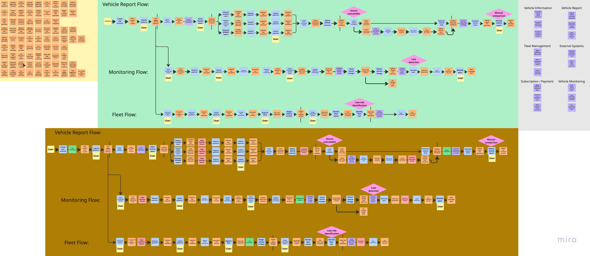

# Capítulo II: Requirements Elicitation & Analysis

## 2.1 Competidores

Para el análisis competitivo se identificaron soluciones que atienden total o parcialmente la consulta de información vehicular en Perú. El criterio de selección considera servicios que permiten revisar datos por placa, obtener reportes, consultar fuentes oficiales o apoyar decisiones de compraventa de vehículos usados.

Los competidores directos priorizados son:

- **Autofact Perú** (<https://www.autofact.pe/>), por su posicionamiento como servicio de reporte vehicular para compra de autos usados.
- **HistorialVehicular.pe** (<https://historialvehicular.pe/>), por ofrecer consulta inicial por placa, informe completo, veredicto de riesgo y PDF descargable.
- **Mi Torito** (<https://mitorito.pe/>), por presentar consulta de historial vehicular, múltiples fuentes, reportes y alertas asociadas al estado del vehículo.

También se consideran como referencias parciales los portales públicos consultados por usuarios, como servicios de SUNARP, MTC, SAT, SBS y otros organismos. Estas fuentes no compiten como producto integral, pero sí forman parte del comportamiento actual de consulta manual.

### 2.1.1 Análisis competitivo

| Competidor | Perfil | Marketing y posicionamiento | Producto | Precios | Canales | Fortalezas | Debilidades |
|---|---|---|---|---|---|---|---|
| Autofact Perú | Servicio orientado a obtener información vehicular antes de comprar un auto usado. | Comunica seguridad en la compra, prevención de problemas y acceso a información por placa. | Reporte vehicular con antecedentes, historial y datos relevantes para decisión de compra. | Modelo de pago por reporte o paquetes, según disponibilidad comercial vigente. | Sitio web, contenido educativo y búsquedas orgánicas. | Marca reconocible, enfoque claro en compraventa y experiencia previa en reportes. | Se concentra principalmente en consulta puntual; no prioriza gestión recurrente de flotas ni seguimiento colaborativo. |
| HistorialVehicular.pe | Servicio digital peruano para consultar historial de vehículos por placa. | Resalta rapidez, veredicto de riesgo, PDF descargable y ahorro de tiempo frente a consulta manual. | Consulta gratuita inicial e informe completo con fuentes oficiales, deudas, papeletas, siniestros, SOAT y revisión técnica. | Publica precios por informe y paquetes; también comunica planes para consultas frecuentes. | Sitio web, contenido informativo y flujo directo de consulta por placa. | Transparencia en precios, foco local, veredicto de riesgo y PDF. | El enfoque principal sigue siendo el reporte individual; la gestión de múltiples vehículos queda como oportunidad. |
| Mi Torito | Servicio de consulta vehicular para compradores, vendedores y usuarios móviles. | Promete revisión rápida, múltiples fuentes verificadas, reporte de riesgo y experiencia simple. | Reportes por placa con propietarios, multas, SOAT, revisiones técnicas, marketplace y alertas. | Publica precio de reporte completo desde S/ 15.90, según información visible en su sitio. | Sitio web, aplicaciones móviles y presencia comercial digital. | Cobertura amplia de fuentes, propuesta simple, soporte móvil y alertas. | Puede percibirse como producto generalista; no presenta una propuesta especializada para flotas pequeñas y medianas. |

#### Competitive Analysis Landscape

| Criterio | Autofact Perú | HistorialVehicular.pe | Mi Torito | Oportunidad para FleetProof |
|---|---|---|---|---|
| Consulta por placa | Alta | Alta | Alta | Mantener consulta por placa como punto de entrada simple. |
| Reporte descargable | Alta | Alta | Alta | Diferenciar el reporte con evidencia, fecha, fuente y explicación del riesgo. |
| Gestión de flotas | Baja | Media | Media | Crear tablero de múltiples vehículos, responsables y estados de revisión. |
| Monitoreo recurrente | Baja | Media | Media | Incorporar seguimiento de cambios relevantes y alertas. |
| Trazabilidad de fuente | Media | Alta | Media | Mostrar origen, fecha y estado de cada fuente consultada. |
| Colaboración interna | Baja | Baja | Baja | Permitir asignación de responsables, observaciones y casos de resolución. |
| Claridad para usuarios no técnicos | Media | Alta | Alta | Usar lenguaje simple, explicación de hallazgos y recomendaciones accionables. |

#### SWOT de BLIP FleetProof frente a competidores

| Tipo | Análisis |
|---|---|
| Fortalezas | Enfoque en monitoreo continuo, trazabilidad de evidencias, gestión de múltiples vehículos y colaboración entre responsables. |
| Oportunidades | Empresas pequeñas y medianas con flotas necesitan pasar de consultas aisladas a control recurrente. Compradores particulares también requieren reportes comprensibles antes de decidir. |
| Debilidades | Producto nuevo, sin reconocimiento de marca ni histórico público de consultas procesadas. |
| Amenazas | Competidores existentes pueden ampliar sus reportes hacia planes recurrentes, alertas o funciones para empresas. |

### 2.1.2 Estrategias y tácticas frente a competidores

La estrategia de BLIP con FleetProof consiste en diferenciarse de los servicios centrados en reportes puntuales mediante una propuesta de control vehicular continuo. El producto no se limitará a entregar un documento final, sino que buscará organizar el ciclo completo de revisión: registro del vehículo, consulta de fuentes, identificación de hallazgos, evaluación de riesgo, generación de evidencia y seguimiento posterior.

Las tácticas principales son:

- **Trazabilidad visible:** cada hallazgo debe mostrar fuente, fecha de consulta y estado de disponibilidad. Esto responde a la incertidumbre identificada en los mapas de empatía y en los recorridos de usuario.
- **Gestión por vehículo y por flota:** el usuario debe poder revisar un vehículo individual o agrupar varios vehículos en una flota, asignando responsables y estados de revisión.
- **Riesgo explicable:** el sistema debe comunicar por qué un vehículo presenta riesgo, evitando depender solo de un color o indicador visual.
- **Reporte compartible:** FleetProof debe generar un resumen que pueda enviarse a clientes, compradores, vendedores o responsables internos.
- **Monitoreo recurrente:** a diferencia del reporte único, el producto debe permitir alertas ante cambios relevantes, vencimientos o inconsistencias posteriores.
- **Lenguaje comprensible:** los textos del producto deben evitar tecnicismos innecesarios y explicar consecuencias prácticas para la toma de decisiones.

Con estas tácticas, BLIP compite no solo por entregar información, sino por reducir incertidumbre operativa durante todo el proceso de validación vehicular.

## 2.2 Entrevistas

### 2.2.1 Diseño de entrevistas

Las entrevistas se diseñaron como conversaciones breves de máximo cinco minutos. El objetivo es obtener evidencia sobre comportamientos actuales, dolores y criterios de decisión sin inducir respuestas positivas hacia FleetProof. Por ello, se evitan preguntas de aprobación como “¿usarías esta aplicación?” y se priorizan preguntas conductuales sobre experiencias reales.

#### Guía de entrevista para Cristhian Amaya

Perfil: consultor automotor y creador de contenido digital.

Duración objetivo: 5 minutos.

| Tiempo estimado | Pregunta | Objetivo |
|---|---|---|
| 0:00 - 0:30 | ¿Cuál fue la última consulta vehicular que recibiste de una persona interesada en comprar o vender un vehículo? | Identificar situación real reciente. |
| 0:30 - 1:15 | ¿Qué datos pediste primero y por qué? | Reconocer datos mínimos para iniciar una revisión. |
| 1:15 - 2:00 | ¿Qué fuentes revisaste para responder esa consulta? | Identificar fuentes usadas y nivel de dispersión. |
| 2:00 - 2:45 | ¿Qué parte te tomó más tiempo o generó más duda? | Detectar puntos de dolor. |
| 2:45 - 3:30 | ¿Cómo explicaste el resultado a la persona que te consultó? | Evaluar necesidad de lenguaje claro. |
| 3:30 - 4:15 | ¿Qué evidencia guardaste o compartiste para respaldar tu recomendación? | Identificar trazabilidad y prueba documental. |
| 4:15 - 5:00 | Si volvieras a atender una consulta similar, ¿qué información quisieras tener ordenada desde el inicio? | Obtener oportunidades sin inducir solución. |

#### Guía de entrevista para Roxana Limo

Perfil: responsable comercial de empresa automotriz.

Duración objetivo: 5 minutos.

| Tiempo estimado | Pregunta | Objetivo |
|---|---|---|
| 0:00 - 0:30 | ¿Cuál fue la última vez que tu equipo tuvo que validar información de un vehículo antes de ofrecerlo o venderlo? | Identificar experiencia comercial real. |
| 0:30 - 1:15 | ¿Qué información necesitaban confirmar antes de continuar con el proceso? | Reconocer datos críticos para decisión comercial. |
| 1:15 - 2:00 | ¿En qué lugares o áreas estaba distribuida esa información? | Identificar dispersión entre sedes, registros y responsables. |
| 2:00 - 2:45 | ¿Qué problemas aparecieron cuando faltó un dato o hubo inconsistencia? | Detectar impacto operativo. |
| 2:45 - 3:30 | ¿Cómo se comunicó la información final al cliente o al equipo interno? | Evaluar forma actual de comunicación. |
| 3:30 - 4:15 | ¿Qué registro queda después de la revisión del vehículo? | Identificar necesidad de historial y seguimiento. |
| 4:15 - 5:00 | ¿Qué señales te hacen decidir que un vehículo está listo para ser ofrecido con confianza? | Obtener criterios de validación y riesgo. |

### 2.2.2 Registro de entrevistas

| Segmento | Entrevistado | Edad | Distrito | Fecha | Screenshot | URL Microsoft Stream | Timing | Duracion |
|---|---|---:|---|---|---|---|---|---|
| Consultores y asesores automotores | Cristhian Amaya | 39 | Chiclayo | Pendiente | Pendiente | Pendiente | 0:00 - 5:00 | 5 minutos |
| Responsables comerciales y operativos | Roxana Limo | 42 | Chiclayo | Pendiente | Pendiente | Pendiente | 0:00 - 5:00 | 5 minutos |

### 2.2.3 Análisis de entrevistas

Debido a que las entrevistas reales aún se encuentran pendientes de registro, esta sección presenta un análisis preliminar basado en los User Personas, Empathy Maps, User Journey Maps y As-is Scenario Maps ya elaborados por el equipo. Los porcentajes no deben presentarse como resultado final de campo; deben reemplazarse por métricas reales cuando se completen y graben las entrevistas.

#### Segmento: consultores y asesores automotores

Base preliminar: perfil de Cristhian Amaya, mapa de empatía, recorrido de usuario y As-is Scenario Map del asesor o generador de contenido automotor.

| Hallazgo preliminar | Evidencia de soporte | Porcentaje estimado para validar |
|---|---|---:|
| Requieren información vehicular organizada antes de emitir una recomendación. | User Persona y Empathy Map de Cristhian. | 80% |
| Dedican tiempo elevado a buscar datos en diferentes fuentes. | Journey Map y As-is Scenario Map del asesor. | 75% |
| Necesitan explicar datos técnicos en lenguaje simple. | Empathy Map de Cristhian y etapa de comunicación de resultados. | 70% |
| Valoran contar con evidencia para respaldar recomendaciones. | User Persona y fase de análisis del recorrido. | 70% |

Interpretación: este segmento necesita que FleetProof reduzca el esfuerzo de búsqueda y convierta los hallazgos en explicaciones comprensibles. La trazabilidad de fuentes es crítica, porque el asesor debe sostener la confianza de su comunidad o de sus clientes.

#### Segmento: responsables comerciales y operativos

Base preliminar: perfil de Roxana Limo, mapa de empatía, recorrido de usuario y As-is Scenario Map del vendedor o equipo comercial.

| Hallazgo preliminar | Evidencia de soporte | Porcentaje estimado para validar |
|---|---|---:|
| Necesitan validar información antes de ofrecer un vehículo al cliente. | User Persona y Journey Map de Roxana. | 85% |
| Tienen información distribuida entre sedes, documentos y responsables. | Empathy Map de Roxana y As-is Scenario Map comercial. | 80% |
| Requieren reducir riesgo de entregar información incompleta. | Frustraciones y objetivos de Roxana. | 75% |
| Necesitan conservar historial de consultas, observaciones y cambios. | Journey Map de Roxana y oportunidades detectadas. | 70% |

Interpretación: este segmento requiere una herramienta de control que permita revisar vehículos con evidencia, asignar responsables y mantener historial. Para este usuario, FleetProof debe enfocarse en coordinación, confiabilidad comercial y reducción de errores antes de presentar información al cliente.

#### Conclusión preliminar

Los hallazgos iniciales muestran que FleetProof debe priorizar tres capacidades: centralización de información vehicular, trazabilidad de evidencias y comunicación clara del riesgo. Esta conclusión deberá contrastarse con entrevistas reales de tres a cinco participantes por segmento, según el alcance definido por el equipo y la rúbrica del curso.

## 2.3 Needfinding

### 2.3.1 User Personas

Los User Personas fueron elaborados en UXPressia para representar a actores relevantes dentro del proceso actual de consulta, validación y uso de información vehicular. Estos perfiles permiten conectar los hallazgos del proceso de investigación con decisiones posteriores de diseño, alcance funcional y priorización de historias de usuario.

Para esta entrega se consideran dos perfiles principales de análisis:

- **Cristhian Amaya**, consultor automotor y creador de contenido digital. Representa a un actor experto que asesora a compradores y vendedores cuando necesitan interpretar información vehicular antes de tomar una decisión.
- **Roxana Limo**, jefa de marcas de Automotores Inka. Representa a una responsable comercial que necesita validar información de vehículos antes de ofrecerlos a clientes y coordinar decisiones entre diferentes sedes.

#### User Persona: Cristhian Amaya

Figura 2.X. User Persona de Cristhian Amaya.

Fuente y enlace al artefacto: UXPressia. URL: [COMPLETAR].

Cristhian evidencia la necesidad de contar con información vehicular confiable, trazable y fácil de explicar. Su trabajo depende de revisar datos antes de brindar recomendaciones, por lo que FleetProof debe permitir consultar un vehículo por placa, consolidar hallazgos relevantes y presentar un resumen comprensible para personas que no dominan términos técnicos del sector automotor.

#### User Persona: Roxana Limo

Figura 2.X. User Persona de Roxana Limo.

Fuente y enlace al artefacto: UXPressia. URL: [COMPLETAR].

Roxana evidencia una necesidad operativa vinculada a la gestión comercial de vehículos. Su principal dificultad es trabajar con información distribuida entre sedes, registros internos y consultas independientes. Para este perfil, FleetProof debe ofrecer una vista centralizada del estado del vehículo, evidencia de la fuente revisada, historial de consultas y soporte para decisiones comerciales con menor riesgo de información incompleta.

### 2.3.2 User Task Matrix

La matriz de tareas resume las actividades actuales identificadas en los perfiles de usuario. La frecuencia e importancia son preliminares y deberán validarse con entrevistas reales antes de la entrega final.

| Tarea actual | Cristhian Amaya - Frecuencia | Cristhian Amaya - Importancia | Roxana Limo - Frecuencia | Roxana Limo - Importancia | Oportunidad para FleetProof |
|---|---|---|---|---|---|
| Recibir consultas o necesidades de validación vehicular | Alta | Alta | Alta | Alta | Registrar solicitudes de revisión con motivo, placa y responsable. |
| Buscar información mediante placa o datos del vehículo | Alta | Alta | Media | Alta | Centralizar consulta vehicular desde una vista única. |
| Revisar documentos, registros internos o fuentes externas | Media | Alta | Alta | Alta | Guardar evidencia, fuente, fecha y observación por cada revisión. |
| Comparar información encontrada para detectar riesgos | Alta | Alta | Alta | Alta | Mostrar inconsistencias, alertas y nivel de riesgo explicable. |
| Comunicar resultados a terceros | Alta | Alta | Media | Alta | Generar resumen claro y reporte compartible. |
| Coordinar acciones con equipos internos | Baja | Media | Alta | Alta | Asignar pendientes, responsables y estado de resolución. |
| Conservar historial de consultas o cambios | Media | Alta | Alta | Alta | Mantener historial por vehículo y trazabilidad de decisiones. |
| Dar seguimiento posterior al vehículo | Media | Media | Media | Alta | Activar monitoreo y alertas ante cambios importantes. |
| Crear contenido o recomendaciones basadas en datos | Alta | Media | Baja | Baja | Convertir hallazgos en explicaciones comprensibles para usuarios. |

La matriz muestra que ambos perfiles comparten tareas críticas relacionadas con búsqueda, verificación, comparación y comunicación de información vehicular. La diferencia principal se encuentra en el contexto de uso: Cristhian prioriza claridad para orientar a su comunidad, mientras Roxana prioriza coordinación interna, respaldo comercial y reducción de riesgos antes de atender clientes.

### 2.3.3 User Journey Mapping

Los User Journey Maps representan la experiencia actual de cada perfil antes de utilizar FleetProof. Se organizaron en cinco etapas: identificación de necesidad, recopilación de información, análisis de datos, gestión de resultados y cierre del proceso. Cada mapa permite reconocer puntos de fricción y oportunidades que serán consideradas en los capítulos de especificación y diseño del producto.

#### User Journey Map: Cristhian Amaya

Figura 2.X. User Journey Map de Cristhian Amaya.

Fuente y enlace al artefacto: UXPressia. URL: [COMPLETAR].

El recorrido de Cristhian inicia cuando recibe consultas de usuarios interesados en conocer información de un vehículo. Luego busca datos en fuentes disponibles, interpreta hallazgos, comunica recomendaciones y mantiene relación con su comunidad. El punto más crítico aparece durante el análisis, debido a la dificultad para comprobar origen, fecha y confiabilidad de los datos. Esto justifica que FleetProof priorice trazabilidad, resumen entendible y soporte para generar evidencia antes de emitir recomendaciones.

#### User Journey Map: Roxana Limo

Figura 2.X. User Journey Map de Roxana Limo.

Fuente y enlace al artefacto: UXPressia. URL: [COMPLETAR].

El recorrido de Roxana inicia con la recepción de información de un vehículo disponible para venta o evaluación. Después coordina con distintas áreas, revisa documentos, valida posibles riesgos y utiliza los datos para preparar información comercial. El mayor dolor ocurre cuando la información se encuentra distribuida o incompleta, ya que puede retrasar decisiones y afectar la confianza del cliente. Esto sustenta funcionalidades vinculadas a historial del vehículo, registro de observaciones, seguimiento entre sedes y reportes verificables.

### 2.3.4 Empathy Mapping

Los Empathy Maps complementan los User Personas al describir lo que cada usuario ve, escucha, piensa, siente, dice y hace durante el proceso de validación vehicular. Esta herramienta ayuda a identificar preocupaciones, motivaciones, dolores y beneficios esperados desde la perspectiva del usuario.

#### Empathy Map: Cristhian Amaya

Figura 2.X. Empathy Map de Cristhian Amaya.

Fuente y enlace al artefacto: UXPressia. URL: [COMPLETAR].

Cristhian percibe que muchas personas compran vehículos usados sin información suficiente o sin capacidad para interpretar datos técnicos. Sus principales dolores son la información dispersa, el tiempo invertido en verificación y la ausencia de una herramienta centralizada para organizar consultas. Sus beneficios esperados se relacionan con reducir tiempo de revisión, brindar respuestas más rápidas y fortalecer la confianza de su comunidad mediante información verificable.

#### Empathy Map: Roxana Limo

Figura 2.X. Empathy Map de Roxana Limo.

Fuente y enlace al artefacto: UXPressia. URL: [COMPLETAR].

Roxana percibe que la confianza del cliente depende de la claridad y confiabilidad de la información entregada durante el proceso comercial. Sus principales dolores son la información distribuida entre fuentes, la dificultad para validar antecedentes con rapidez y la falta de seguimiento histórico. Sus beneficios esperados se relacionan con coordinación entre sedes, evidencia verificable, reducción de tiempos de validación y toma de decisiones comerciales con mayor seguridad.

### 2.3.5 As-is Scenario Mapping

En esta sección se registran los As-is Scenario Maps elaborados para representar la situación actual de los actores vinculados al problema de FleetProof, antes de introducir la solución propuesta por BLIP. Los mapas se construyeron con una estructura de tres niveles: acciones realizadas, pensamientos del usuario y emociones experimentadas durante el proceso. Esta lectura permite identificar puntos de dolor, necesidades de información y oportunidades para el diseño posterior de requisitos, historias de usuario y flujos de la aplicación web.

Los mapas enviados deben tratarse como evidencia visual de trabajo del equipo. Antes de la entrega final, se recomienda reemplazar o complementar las descripciones preliminares con hallazgos obtenidos en entrevistas reales, indicando fecha, herramienta utilizada, integrantes participantes y enlace al tablero original.

#### Segmento 1: responsables de flotas pequeñas y medianas

Figura 2.X. As-is Scenario Map para responsables de flotas pequeñas y medianas.

Fuente y enlace al artefacto: tablero elaborado por el equipo en Miro. URL: [COMPLETAR].

Este mapa representa el recorrido de un responsable que recibe la necesidad de revisar documentación vehicular, busca información en diversas fuentes, verifica datos y documentos, gestiona problemas encontrados y toma decisiones operativas. El principal dolor identificado es la dispersión de información y el seguimiento manual de pendientes, lo que sustenta funciones como checklist por fuente, dashboard de riesgo, registro de evidencia y casos de resolución.

#### Segmento 2: propietarios o compradores particulares

Figura 2.X. As-is Scenario Map para propietarios o compradores particulares.

Fuente y enlace al artefacto: tablero elaborado por el equipo en Miro. URL: [COMPLETAR].

Este mapa muestra el proceso de una persona que identifica interés por un vehículo, busca información mediante la placa, evalúa los datos encontrados, decide si continúa con la compra y realiza seguimiento posterior. Los puntos de dolor principales se relacionan con incertidumbre, exceso de información disponible e interpretación de datos. Esto sustenta la necesidad de un reporte claro, riesgo explicable, PDF compartible y monitoreo básico posterior.

#### Actor complementario: vendedor o equipo comercial

Figura 2.X. As-is Scenario Map para vendedor o equipo comercial.

Fuente y enlace al artefacto: tablero elaborado por el equipo en Miro. URL: [COMPLETAR].

Este mapa describe el trabajo de un vendedor o equipo comercial que recibe información del vehículo, revisa registros disponibles, valida antecedentes, prepara información comercial y atiende al cliente. Aunque este actor no necesariamente constituye un segmento independiente, ayuda a comprender el valor de la transparencia en procesos de compraventa y puede alimentar historias vinculadas a reportes compartibles y evidencia confiable.

#### Actor complementario: asesor o generador de contenido automotor

Figura 2.X. As-is Scenario Map para asesor o generador de contenido automotor.

Fuente y enlace al artefacto: tablero elaborado por el equipo en Miro. URL: [COMPLETAR].

Este mapa representa a un actor que recibe consultas de usuarios, investiga información vehicular, analiza datos, comunica resultados y mantiene confianza con su comunidad. Debe utilizarse como actor complementario, no como segmento principal, salvo que el equipo decida ampliar formalmente el alcance. Su aporte principal para FleetProof es reforzar la importancia de comunicar resultados de manera clara, verificable y útil para la toma de decisiones.

#### Síntesis de oportunidades derivadas

| Oportunidad | Sustento en los mapas | Relación con el producto |
|---|---|---|
| Centralizar información por vehículo | Los actores buscan datos en fuentes separadas y comparan documentos manualmente. | Registro de vehículo, Source Check y Evidence. |
| Explicar el riesgo encontrado | Usuarios particulares y asesores necesitan interpretar datos sin ambigüedad. | Risk Assessment con explicación textual, no solo visual. |
| Conservar trazabilidad | Flotas y vendedores requieren demostrar de dónde salió cada dato. | Fuente, fecha, evidencia y responsable por revisión. |
| Dar seguimiento a pendientes | Las flotas gestionan problemas y responsables de forma manual. | Alert y Resolution Case. |
| Compartir resultados confiables | Compradores, vendedores y asesores comunican información a terceros. | Reporte descargable y resumen compartible. |

## 2.4 Big Picture Event Storming

El Big Picture Event Storming fue elaborado en Miro para analizar el dominio de FleetProof desde una perspectiva de eventos, decisiones, actores, fuentes externas y preguntas abiertas. El tablero se encuentra disponible en el siguiente enlace: <https://miro.com/app/board/uXjVHntEsLk=/>.

La dinámica se organizó en tres fases:

- **Open:** identificación amplia de eventos del dominio, sin ordenar todavía el flujo.
- **Explore:** organización de eventos en flujos principales y detección de decisiones, actores y sistemas externos.
- **Close:** agrupación de preguntas abiertas que deben resolverse antes del diseño detallado.

Figura 2.X. Vista general del Big Picture Event Storming de FleetProof.

Fuente y enlace al artefacto: tablero elaborado por el equipo en Miro. URL: <https://miro.com/app/board/uXjVHntEsLk=/>.

### 2.4.1 Fase Open

Figura 2.X. Fase Open del Big Picture Event Storming.

En la fase Open se identificaron eventos del dominio relacionados con registro de vehículo, consulta por placa, solicitud de información, revisión de documentos, obtención de datos, generación de reportes, identificación de riesgos, activación de monitoreo, detección de cambios y envío de alertas. Esta fase permitió reconocer que FleetProof no se limita a una consulta aislada, sino que incluye procesos posteriores de seguimiento, revisión y gestión de evidencias.

### 2.4.2 Fase Explore

Figura 2.X. Fase Explore del Big Picture Event Storming.

En la fase Explore se ordenaron los eventos en tres flujos principales:

- **Vehicle Report Flow:** cubre registro de usuario, consulta vehicular, pago, consulta de fuentes oficiales, consolidación de información, generación de reporte y revisión final por el usuario.
- **Monitoring Flow:** cubre selección del servicio de monitoreo, activación de suscripción, registro de placa monitoreada, revisión periódica, detección de cambios y notificación.
- **Fleet Flow:** cubre selección de servicio para gestión de flotas, registro de flota, asignación de vehículos, revisión de estado, identificación de riesgo y notificación a responsables.

La fase Explore también permitió identificar decisiones relevantes, como disponibilidad de fuentes externas, detección tardía de riesgos y comparación manual de información por parte del usuario.

### 2.4.3 Fase Close

Figura 2.X. Fase Close del Big Picture Event Storming.

En la fase Close se agruparon preguntas abiertas por tema. Las principales categorías fueron Vehicle Information, Vehicle Report, Fleet Management, External Systems, Subscription / Payment y Vehicle Monitoring. Estas preguntas ayudan a definir límites del producto y reducir incertidumbre técnica antes de construir historias de usuario.

| Categoría | Preguntas abiertas | Decisión pendiente |
|---|---|---|
| Vehicle Information | ¿Qué fuentes oficiales brindan información?, ¿qué ocurre si una fuente no está disponible?, ¿cada cuánto se actualiza la información? | Definir fuentes iniciales y política de actualización. |
| Vehicle Report | ¿Cómo se valida la precisión del reporte?, ¿cuánto tiempo estará disponible?, ¿qué ocurre si falla la generación? | Definir vigencia del reporte, manejo de fallos y evidencia visible. |
| Fleet Management | ¿Qué define un riesgo de flota?, ¿quién es responsable por cada vehículo?, ¿cómo se calcula el riesgo? | Definir reglas de riesgo y responsables internos. |
| External Systems | ¿Cómo impacta CAPTCHA en tiempo de consulta?, ¿qué ocurre si falla un servicio externo? | Definir estrategia de manejo de indisponibilidad. |
| Subscription / Payment | ¿Qué ocurre si falla un pago?, ¿cuándo se activa la suscripción?, ¿qué servicios requieren suscripción activa? | Definir reglas de activación y restricciones por plan. |
| Vehicle Monitoring | ¿Qué cambios generan alertas?, ¿con qué frecuencia se revisan los vehículos?, ¿quién recibe la alerta? | Definir frecuencia de monitoreo y destinatarios. |

## 2.5 Ubiquitous Language

| Term | Definition |
|---|---|
| User Account | Cuenta creada por una persona para acceder a FleetProof y consultar información vehicular. |
| License Plate | Identificador de placa usado como dato inicial para buscar información de un vehículo. |
| Vehicle | Unidad vehicular registrada o consultada dentro de FleetProof. |
| Vehicle Report | Reporte consolidado que resume información vehicular obtenida desde fuentes disponibles. |
| Report Request | Solicitud realizada por el usuario para investigar un vehículo. |
| Source Check | Revisión individual de una fuente específica relacionada con el vehículo. |
| Official Source | Fuente pública u oficial usada para obtener o contrastar información vehicular. |
| External Source | Fuente externa complementaria que aporta información para la evaluación vehicular. |
| Source Unavailable | Estado generado cuando una fuente no responde o no permite completar la consulta. |
| Finding | Dato relevante que requiere atención, explicación o seguimiento. |
| Evidence | Registro que respalda un dato encontrado, incluyendo fuente, fecha y estado de consulta. |
| Snapshot | Estado consolidado del vehículo en una fecha determinada. |
| Risk Assessment | Evaluación explicable basada en hallazgos, reglas de negocio y estado de fuentes consultadas. |
| Fleet | Conjunto de vehículos agrupados para seguimiento operativo o comercial. |
| Fleet Risk | Riesgo calculado sobre uno o varios vehículos asociados a una flota. |
| Monitoring Service | Servicio que revisa cambios relevantes después de registrar un vehículo para seguimiento. |
| Alert | Notificación generada cuando se detecta un cambio, vencimiento o riesgo relevante. |
| Responsible Person | Usuario asignado para revisar una observación o dar seguimiento a un vehículo. |
| Resolution Case | Trabajo asignado para resolver una observación detectada durante la revisión. |
| Subscription | Acceso activo que habilita servicios recurrentes como monitoreo o gestión de flotas. |
| Payment | Operación económica asociada a un reporte, plan o servicio dentro de FleetProof. |
