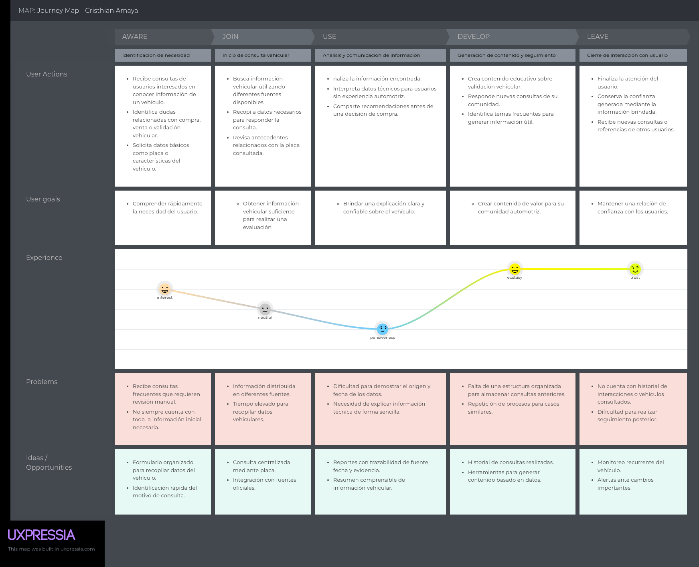
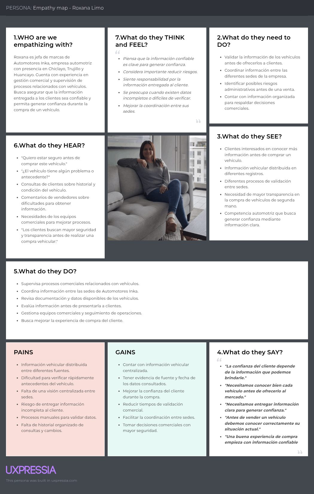
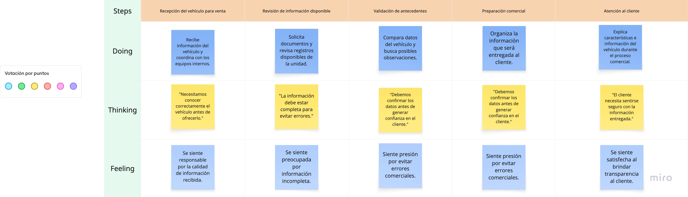

# Capítulo II: Requirements Elicitation & Analysis

## 2.1 Competidores

TODO: Identificar mínimo 3 competidores directos. Candidatos iniciales:

- Autofact Pro Perú.
- HistorialVehicular.pe.
- Mi Torito.
- InfoVehicular.

### 2.1.1 Análisis competitivo

TODO: Completar Competitive Analysis Landscape con perfil, marketing, producto, precios, canales y SWOT.

### 2.1.2 Estrategias y tacticas frente a competidores

TODO: Redactar estrategia BLIP frente a reporte puntual, monitoreo recurrente, trazabilidad y gestión colaborativa.

## 2.2 Entrevistas

### 2.2.1 Diseño de entrevistas

TODO: Preparar preguntas conductuales por segmento. Evitar preguntas de aprobacion como "usarias esta aplicacion".

### 2.2.2 Registro de entrevistas

| Segmento | Entrevistado | Edad | Distrito | Fecha | Screenshot | URL Microsoft Stream | Timing | Duracion |
|---|---|---:|---|---|---|---|---|---|
| Empresas con flotas | TODO | TODO | TODO | TODO | TODO | TODO | TODO | TODO |
| Propietarios y compradores | TODO | TODO | TODO | TODO | TODO | TODO | TODO | TODO |

### 2.2.3 Análisis de entrevistas

TODO: Analizar cada segmento con porcentajes derivados de entrevistas.

## 2.3 Needfinding

### 2.3.1 User Personas

Los User Personas fueron elaborados en UXPressia para representar a actores relevantes dentro del proceso actual de consulta, validación y uso de información vehicular. Estos perfiles permiten conectar los hallazgos del proceso de investigación con decisiones posteriores de diseño, alcance funcional y priorización de historias de usuario.

Para esta entrega se consideran dos perfiles principales de análisis:

- **Cristhian Amaya**, consultor automotor y creador de contenido digital. Representa a un actor experto que asesora a compradores y vendedores cuando necesitan interpretar información vehicular antes de tomar una decisión.
- **Roxana Limo**, jefa de marcas de Automotores Inka. Representa a una responsable comercial que necesita validar información de vehículos antes de ofrecerlos a clientes y coordinar decisiones entre diferentes sedes.

#### User Persona: Cristhian Amaya

Figura 2.X. User Persona de Cristhian Amaya.

Fuente y enlace al artefacto: UXPressia. URL: [COMPLETAR].

Cristhian evidencia la necesidad de contar con información vehicular confiable, trazable y fácil de explicar. Su trabajo depende de revisar datos antes de brindar recomendaciones, por lo que FleetProof debe permitir consultar un vehículo por placa, consolidar hallazgos relevantes y presentar un resumen comprensible para personas que no dominan términos técnicos del sector automotor.

#### User Persona: Roxana Limo

Figura 2.X. User Persona de Roxana Limo.

Fuente y enlace al artefacto: UXPressia. URL: [COMPLETAR].

Roxana evidencia una necesidad operativa vinculada a la gestión comercial de vehículos. Su principal dificultad es trabajar con información distribuida entre sedes, registros internos y consultas independientes. Para este perfil, FleetProof debe ofrecer una vista centralizada del estado del vehículo, evidencia de la fuente revisada, historial de consultas y soporte para decisiones comerciales con menor riesgo de información incompleta.

### 2.3.2 User Task Matrix

La matriz de tareas resume las actividades actuales identificadas en los perfiles de usuario. La frecuencia e importancia son preliminares y deberán validarse con entrevistas reales antes de la entrega final.

| Tarea actual | Cristhian Amaya - Frecuencia | Cristhian Amaya - Importancia | Roxana Limo - Frecuencia | Roxana Limo - Importancia | Oportunidad para FleetProof |
|---|---|---|---|---|---|
| Recibir consultas o necesidades de validación vehicular | Alta | Alta | Alta | Alta | Registrar solicitudes de revisión con motivo, placa y responsable. |
| Buscar información mediante placa o datos del vehículo | Alta | Alta | Media | Alta | Centralizar consulta vehicular desde una vista única. |
| Revisar documentos, registros internos o fuentes externas | Media | Alta | Alta | Alta | Guardar evidencia, fuente, fecha y observación por cada revisión. |
| Comparar información encontrada para detectar riesgos | Alta | Alta | Alta | Alta | Mostrar inconsistencias, alertas y nivel de riesgo explicable. |
| Comunicar resultados a terceros | Alta | Alta | Media | Alta | Generar resumen claro y reporte compartible. |
| Coordinar acciones con equipos internos | Baja | Media | Alta | Alta | Asignar pendientes, responsables y estado de resolución. |
| Conservar historial de consultas o cambios | Media | Alta | Alta | Alta | Mantener historial por vehículo y trazabilidad de decisiones. |
| Dar seguimiento posterior al vehículo | Media | Media | Media | Alta | Activar monitoreo y alertas ante cambios importantes. |
| Crear contenido o recomendaciones basadas en datos | Alta | Media | Baja | Baja | Convertir hallazgos en explicaciones comprensibles para usuarios. |

La matriz muestra que ambos perfiles comparten tareas críticas relacionadas con búsqueda, verificación, comparación y comunicación de información vehicular. La diferencia principal se encuentra en el contexto de uso: Cristhian prioriza claridad para orientar a su comunidad, mientras Roxana prioriza coordinación interna, respaldo comercial y reducción de riesgos antes de atender clientes.

### 2.3.3 User Journey Mapping

Los User Journey Maps representan la experiencia actual de cada perfil antes de utilizar FleetProof. Se organizaron en cinco etapas: identificación de necesidad, recopilación de información, análisis de datos, gestión de resultados y cierre del proceso. Cada mapa permite reconocer puntos de fricción y oportunidades que serán consideradas en los capítulos de especificación y diseño del producto.

#### User Journey Map: Cristhian Amaya

Figura 2.X. User Journey Map de Cristhian Amaya.

Fuente y enlace al artefacto: UXPressia. URL: [COMPLETAR].

El recorrido de Cristhian inicia cuando recibe consultas de usuarios interesados en conocer información de un vehículo. Luego busca datos en fuentes disponibles, interpreta hallazgos, comunica recomendaciones y mantiene relación con su comunidad. El punto más crítico aparece durante el análisis, debido a la dificultad para comprobar origen, fecha y confiabilidad de los datos. Esto justifica que FleetProof priorice trazabilidad, resumen entendible y soporte para generar evidencia antes de emitir recomendaciones.

#### User Journey Map: Roxana Limo

Figura 2.X. User Journey Map de Roxana Limo.

Fuente y enlace al artefacto: UXPressia. URL: [COMPLETAR].

El recorrido de Roxana inicia con la recepción de información de un vehículo disponible para venta o evaluación. Después coordina con distintas áreas, revisa documentos, valida posibles riesgos y utiliza los datos para preparar información comercial. El mayor dolor ocurre cuando la información se encuentra distribuida o incompleta, ya que puede retrasar decisiones y afectar la confianza del cliente. Esto sustenta funcionalidades vinculadas a historial del vehículo, registro de observaciones, seguimiento entre sedes y reportes verificables.

### 2.3.4 Empathy Mapping

Los Empathy Maps complementan los User Personas al describir lo que cada usuario ve, escucha, piensa, siente, dice y hace durante el proceso de validación vehicular. Esta herramienta ayuda a identificar preocupaciones, motivaciones, dolores y beneficios esperados desde la perspectiva del usuario.

#### Empathy Map: Cristhian Amaya

Figura 2.X. Empathy Map de Cristhian Amaya.

Fuente y enlace al artefacto: UXPressia. URL: [COMPLETAR].

Cristhian percibe que muchas personas compran vehículos usados sin información suficiente o sin capacidad para interpretar datos técnicos. Sus principales dolores son la información dispersa, el tiempo invertido en verificación y la ausencia de una herramienta centralizada para organizar consultas. Sus beneficios esperados se relacionan con reducir tiempo de revisión, brindar respuestas más rápidas y fortalecer la confianza de su comunidad mediante información verificable.

#### Empathy Map: Roxana Limo

Figura 2.X. Empathy Map de Roxana Limo.

Fuente y enlace al artefacto: UXPressia. URL: [COMPLETAR].

Roxana percibe que la confianza del cliente depende de la claridad y confiabilidad de la información entregada durante el proceso comercial. Sus principales dolores son la información distribuida entre fuentes, la dificultad para validar antecedentes con rapidez y la falta de seguimiento histórico. Sus beneficios esperados se relacionan con coordinación entre sedes, evidencia verificable, reducción de tiempos de validación y toma de decisiones comerciales con mayor seguridad.

### 2.3.5 As-is Scenario Mapping

En esta sección se registran los As-is Scenario Maps elaborados para representar la situación actual de los actores vinculados al problema de FleetProof, antes de introducir la solución propuesta por BLIP. Los mapas se construyeron con una estructura de tres niveles: acciones realizadas, pensamientos del usuario y emociones experimentadas durante el proceso. Esta lectura permite identificar puntos de dolor, necesidades de información y oportunidades para el diseño posterior de requisitos, historias de usuario y flujos de la aplicación web.

Los mapas enviados deben tratarse como evidencia visual de trabajo del equipo. Antes de la entrega final, se recomienda reemplazar o complementar las descripciones preliminares con hallazgos obtenidos en entrevistas reales, indicando fecha, herramienta utilizada, integrantes participantes y enlace al tablero original.

#### Segmento 1: responsables de flotas pequeñas y medianas

Figura 2.X. As-is Scenario Map para responsables de flotas pequeñas y medianas.

Fuente y enlace al artefacto: tablero elaborado por el equipo en Miro. URL: [COMPLETAR].

Este mapa representa el recorrido de un responsable que recibe la necesidad de revisar documentación vehicular, busca información en diversas fuentes, verifica datos y documentos, gestiona problemas encontrados y toma decisiones operativas. El principal dolor identificado es la dispersión de información y el seguimiento manual de pendientes, lo que sustenta funciones como checklist por fuente, dashboard de riesgo, registro de evidencia y casos de resolución.

#### Segmento 2: propietarios o compradores particulares

Figura 2.X. As-is Scenario Map para propietarios o compradores particulares.

Fuente y enlace al artefacto: tablero elaborado por el equipo en Miro. URL: [COMPLETAR].

Este mapa muestra el proceso de una persona que identifica interés por un vehículo, busca información mediante la placa, evalúa los datos encontrados, decide si continúa con la compra y realiza seguimiento posterior. Los puntos de dolor principales se relacionan con incertidumbre, exceso de información disponible e interpretación de datos. Esto sustenta la necesidad de un reporte claro, riesgo explicable, PDF compartible y monitoreo básico posterior.

#### Actor complementario: vendedor o equipo comercial

Figura 2.X. As-is Scenario Map para vendedor o equipo comercial.

Fuente y enlace al artefacto: tablero elaborado por el equipo en Miro. URL: [COMPLETAR].

Este mapa describe el trabajo de un vendedor o equipo comercial que recibe información del vehículo, revisa registros disponibles, valida antecedentes, prepara información comercial y atiende al cliente. Aunque este actor no necesariamente constituye un segmento independiente, ayuda a comprender el valor de la transparencia en procesos de compraventa y puede alimentar historias vinculadas a reportes compartibles y evidencia confiable.

#### Actor complementario: asesor o generador de contenido automotor

Figura 2.X. As-is Scenario Map para asesor o generador de contenido automotor.

Fuente y enlace al artefacto: tablero elaborado por el equipo en Miro. URL: [COMPLETAR].

Este mapa representa a un actor que recibe consultas de usuarios, investiga información vehicular, analiza datos, comunica resultados y mantiene confianza con su comunidad. Debe utilizarse como actor complementario, no como segmento principal, salvo que el equipo decida ampliar formalmente el alcance. Su aporte principal para FleetProof es reforzar la importancia de comunicar resultados de manera clara, verificable y útil para la toma de decisiones.

#### Síntesis de oportunidades derivadas

| Oportunidad | Sustento en los mapas | Relación con el producto |
|---|---|---|
| Centralizar información por vehículo | Los actores buscan datos en fuentes separadas y comparan documentos manualmente. | Registro de vehículo, Source Check y Evidence. |
| Explicar el riesgo encontrado | Usuarios particulares y asesores necesitan interpretar datos sin ambigüedad. | Risk Assessment con explicación textual, no solo visual. |
| Conservar trazabilidad | Flotas y vendedores requieren demostrar de dónde salió cada dato. | Fuente, fecha, evidencia y responsable por revisión. |
| Dar seguimiento a pendientes | Las flotas gestionan problemas y responsables de forma manual. | Alert y Resolution Case. |
| Compartir resultados confiables | Compradores, vendedores y asesores comunican información a terceros. | Reporte descargable y resumen compartible. |

## 2.4 Big Picture Event Storming

TODO: Incluir captura y explicación de eventos principales del dominio.

## 2.5 Ubiquitous Language

| Term | Definition |
|---|---|
| Report Request | Solicitud para investigar un vehículo. |
| Source Check | Resultado de revisar una fuente concreta. |
| Finding | Dato que requiere atencion o interpretacion. |
| Snapshot | Estado consolidado del vehículo en una fecha. |
| Risk Assessment | Evaluación explicable basada en reglas. |
| Resolution Case | Trabajo asignado para resolver una observacion. |
