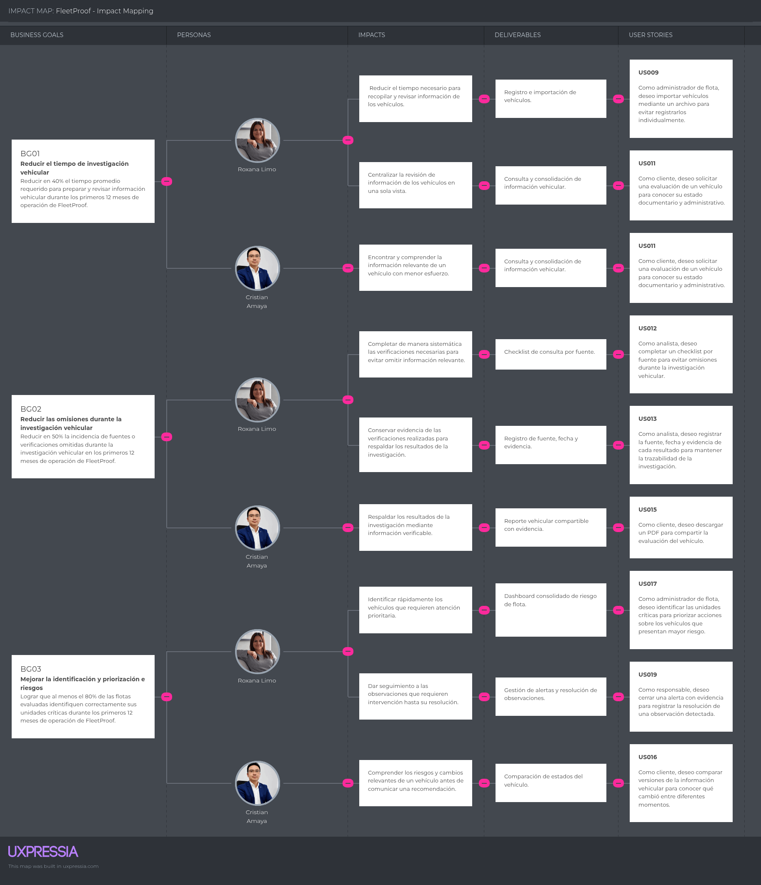
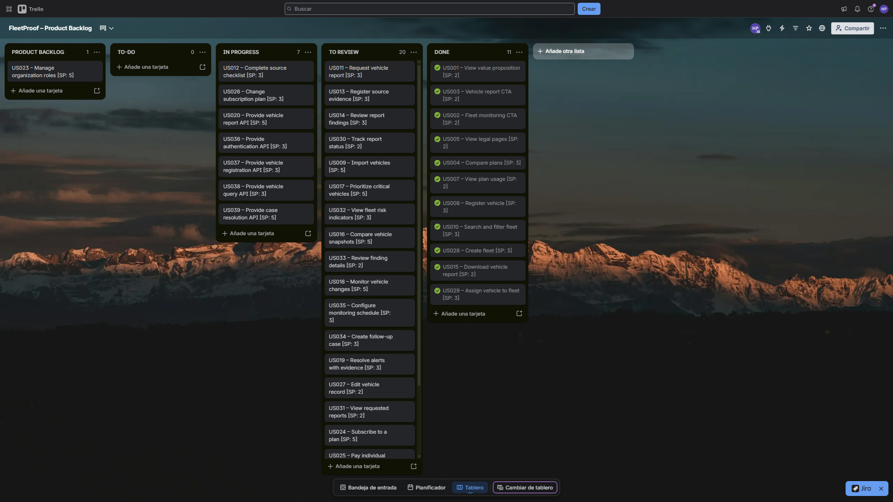

# Capítulo III: Requirements Specification

## 3.1 User Stories

Las User Stories de FleetProof se definieron a partir del análisis realizado en el Capítulo II, considerando los segmentos objetivo, los User Personas, las tareas identificadas, los recorridos actuales y los eventos del dominio obtenidos mediante Big Picture Event Storming.

Las historias se organizan en ocho Epics que representan las principales capacidades del modelo de negocio digital: Landing Page, Identity and Access, Subscriptions, Fleet Management, Report Processing, Risk Intelligence, Monitoring y RESTful API.

Cada User Story describe una necesidad desde la perspectiva del usuario o, cuando corresponde, del Developer para funcionalidades técnicas del RESTful API. Los criterios de aceptación se expresan mediante la estructura Given-When-Then, utilizando condiciones comprobables y evitando especificar detalles particulares de la interfaz de usuario.

Las historias relacionadas con la Landing Page permiten comunicar la propuesta de valor y conectar a los visitantes con las experiencias de la Web Application. Las historias correspondientes al core business priorizan la investigación vehicular, la gestión de flotas, la evaluación de riesgos, la generación de evidencia y el monitoreo recurrente.

| **Epic / Story ID** | **Título**                   | **Descripción**                                                                                                                                                                        | **Criterios de Aceptación**                                                                                                                                                                                                                                                                                                    | **Relacionado con** |
| ------------------- | ---------------------------- | -------------------------------------------------------------------------------------------------------------------------------------------------------------------------------------- | ------------------------------------------------------------------------------------------------------------------------------------------------------------------------------------------------------------------------------------------------------------------------------------------------------------------------------ | ------------------- |
| **EP01**            | **Landing Page**             | Presentación pública del modelo de negocio y propuesta de valor de FleetProof.                                                                                                         | -                                                                                                                                                                                                                                                                                                                              | -                   |
| **US001**           | View value proposition       | Como visitante, deseo visualizar la propuesta de valor para comprender el beneficio de FleetProof.                                                                                     | Given el visitante ingresa al Landing Page, When revisa la sección principal, Then visualiza la propuesta de valor, los segmentos objetivo y el call-to-action.    Given el visitante revisa la propuesta de valor, When consulta la información presentada, Then puede identificar el beneficio principal que ofrece FleetProof.                                                                                                                                                                | EP01                |
| **US002**           | Fleet monitoring CTA         | Como visitante empresarial, deseo acceder al flujo de monitoreo de flota para iniciar la evaluación de mi organización.                                                                | Given el visitante empresarial revisa el Landing Page, When selecciona el call-to-action de flota, Then es dirigido al flujo correspondiente de la Web Application.     Given el visitante empresarial selecciona el call-to-action de flota, When se inicia la navegación, Then accede al flujo correspondiente sin permanecer en el Landing Page.               | EP01                |
| **US003**           | Vehicle report CTA           | Como visitante particular, deseo acceder al flujo de consulta vehicular para solicitar un reporte.                                                                                     | Given el visitante particular revisa el Landing Page, When selecciona el call-to-action de consulta, Then es dirigido al flujo correspondiente de la Web Application.     Given el visitante particular selecciona el call-to-action de consulta, When se inicia la navegación, Then accede al flujo correspondiente para solicitar una evaluación vehicular. | EP01                |
| **US004**           | Compare plans                | Como visitante, deseo comparar planes y límites para elegir la opción adecuada.                                                                                                        | Given el visitante revisa la sección de planes, When compara las opciones disponibles, Then identifica los límites, beneficios y restricciones de cada plan.     Given el visitante compara las opciones disponibles, When revisa las características de cada plan, Then puede distinguir las diferencias entre sus límites y beneficios. | EP01                |
| **US005**           | View legal pages             | Como visitante, deseo acceder a Terms and Conditions y Privacy Policy para conocer las condiciones de uso y protección de datos.                                                       | Given el visitante está en el Landing Page, When selecciona uno de los enlaces legales del footer, Then visualiza el contenido correspondiente.      Given el visitante selecciona una página legal, When solicita su contenido, Then se presenta la información correspondiente a los términos de uso o política de privacidad.   | EP01                |
| **EP02**            | **Identity and Access**      | Gestión de cuentas y acceso de los usuarios a los recursos autorizados de FleetProof.                                                                                                  | -                                                                                                                                                                                                                                                                                                                              | -                   |
| **US006**           | Manage user access           | Como usuario, deseo crear una cuenta e iniciar sesión para acceder a las funcionalidades correspondientes a mi perfil.                                                                 | Given una persona proporciona información válida para registrarse, When se procesa la solicitud, Then se crea su cuenta.     Given el usuario registrado proporciona credenciales válidas, When inicia sesión, Then obtiene acceso a los recursos autorizados para su rol.                                                         | EP02                |
| **US021**           | Update account profile       | Como usuario, deseo actualizar mi nombre de usuario y mi contraseña para mantener vigentes mis datos de acceso. | Given el usuario confirma su contraseña actual y proporciona datos válidos, When guarda los cambios, Then sus datos de acceso quedan actualizados y, si modificó la contraseña, debe iniciar sesión nuevamente.    Given el usuario proporciona una contraseña actual incorrecta o un nombre de usuario ya registrado, When intenta guardar los cambios, Then sus datos de acceso no son modificados. | EP02 |
| **US022**           | Delete account               | Como usuario, deseo eliminar mi cuenta para retirar mis datos de FleetProof cuando ya no utilice el servicio. | Given el usuario confirma la eliminación con su contraseña actual, When se procesa la solicitud, Then su cuenta y los registros asociados son eliminados y su sesión se cierra.    Given el usuario proporciona una contraseña actual incorrecta, When solicita eliminar su cuenta, Then la cuenta no es eliminada. | EP02 |
| **US023**           | Manage organization roles    | Como administrador de flota, deseo incorporar miembros a mi organización y asignarles un rol para que accedan únicamente a las funciones que les corresponden. | Given el administrador incorpora a un miembro con un rol de analista, supervisor o responsable, When el miembro inicia sesión, Then accede solo a los recursos autorizados para dicho rol.    Given el administrador retira a un miembro de la organización, When el miembro intenta acceder a los recursos de la organización, Then el acceso es denegado. | EP02 |
| **EP03**            | **Subscriptions**            | Gestión de planes, límites y servicios habilitados para los usuarios de FleetProof.                                                                                                    | -                                                                                                                                                                                                                                                                                                                              | -                   |
| **US007**           | View plan usage              | Como suscriptor, deseo consultar el consumo de mi plan para conocer los límites y servicios disponibles.                                                                               | Given el usuario posee un plan activo, When consulta el estado de su suscripción, Then puede visualizar los límites definidos y el consumo realizado.     Given el usuario posee un plan activo, When consulta nuevamente su consumo, Then la información mostrada corresponde al estado actual de su suscripción. | EP03                |
| **US024**           | Subscribe to a plan          | Como administrador de flota, deseo contratar un plan de suscripción para habilitar la gestión de flotas y el monitoreo de vehículos. | Given el usuario selecciona un plan y confirma el pago, When se procesa la contratación, Then la suscripción queda activa y se habilitan los servicios de flota y monitoreo.    Given el usuario no posee una suscripción activa, When intenta crear una flota o activar el monitoreo de un vehículo, Then la operación no se realiza y se indica que requiere una suscripción activa. | EP03 |
| **US025**           | Pay individual report        | Como cliente particular, deseo pagar una consulta individual por placa para obtener el reporte de un vehículo sin contratar una suscripción. | Given el cliente ingresa una placa con formato válido y confirma el pago, When se procesa la consulta, Then se registra un reporte asociado a dicha placa y queda disponible para su consulta.    Given el cliente ingresa una placa con formato inválido, When intenta continuar con el pago, Then el pago no se inicia y se indica el error en la placa. | EP03 |
| **US026**           | Change subscription plan     | Como suscriptor, deseo cambiar de plan para ajustar mi suscripción a las necesidades de mi organización. | Given el suscriptor posee un plan activo y selecciona otro plan disponible, When confirma el pago, Then su suscripción se actualiza al nuevo plan y permanece activa.    Given la cuenta alcanzó el límite de vehículos, reportes o monitoreos de su plan, When intenta registrar un nuevo recurso, Then la operación es rechazada indicando que se alcanzó el límite del plan. | EP03 |
| **EP04**            | **Fleet Management**         | Gestión de vehículos pertenecientes a una organización o flota.                                                                                                                        | -                                                                                                                                                                                                                                                                                                                              | -                   |
| **US008**           | Register vehicle             | Como administrador de flota, deseo registrar un vehículo para incorporarlo al control de mi organización.                                                                              | Given el administrador proporciona los datos requeridos de un vehículo, When registra el vehículo, Then este queda asociado a la organización correspondiente.     Given el administrador proporciona información incompleta o inválida, When intenta registrar el vehículo, Then el vehículo no es incorporado a la organización.  | EP04                |
| **US009**           | Import vehicles              | Como administrador de flota, deseo importar vehículos mediante un archivo para evitar registrarlos individualmente.                                                                    | Given el administrador proporciona un archivo CSV válido, When solicita la importación, Then los registros válidos son incorporados a la flota.     Given existen registros inválidos, When se procesa la importación, Then estos son identificados y no son incorporados.                                                         | EP04                |
| **US010**           | Search and filter fleet      | Como administrador de flota, deseo buscar y filtrar vehículos para localizar rápidamente las unidades que requieren atención.                                                          | Given la organización posee vehículos registrados, When el administrador aplica criterios de búsqueda o filtrado, Then el sistema muestra los vehículos que cumplen dichos criterios.     Given la organización posee vehículos registrados, When el administrador aplica un criterio que no coincide con ningún vehículo, Then el sistema indica que no existen unidades que cumplan dicho criterio.   | EP04                |
| **US027**           | Edit vehicle record          | Como administrador de flota, deseo editar los datos de un vehículo registrado para mantener actualizada la información de mi flota. | Given el vehículo pertenece a la organización, When el administrador modifica sus datos con información válida, Then el vehículo conserva los datos actualizados.    Given el administrador ingresa una placa con formato inválido o ya registrada en otro vehículo, When intenta guardar los cambios, Then los datos del vehículo no son modificados. | EP04 |
| **US028**           | Create fleet                 | Como administrador de flota, deseo crear flotas para organizar mis vehículos según la operación de mi organización. | Given el administrador posee una suscripción activa y proporciona un nombre para la flota, When registra la flota, Then esta queda disponible para asignarle vehículos.    Given el administrador no proporciona un nombre para la flota, When intenta registrarla, Then la flota no es creada. | EP04 |
| **US029**           | Assign vehicle to fleet      | Como administrador de flota, deseo asignar un vehículo a una flota junto con su responsable para definir quién da seguimiento a sus observaciones. | Given existen una flota y un vehículo registrados, When el administrador asigna el vehículo a la flota indicando un responsable, Then el vehículo queda asociado a la flota y al responsable indicado.    Given el vehículo ya se encuentra asignado a una flota, When el administrador intenta asignarlo nuevamente, Then la asignación no se registra y se indica que el vehículo ya está asignado. | EP04 |
| **EP05**            | **Report Processing**        | Gestión del proceso de investigación, revisión y generación de reportes vehiculares.| -                                                                                                                                                                                                                                                                                                                              | -                   |
| **US011**           | Request vehicle report       | Como cliente, deseo solicitar una evaluación de un vehículo para conocer su estado documentario y administrativo.                                                                      | Given el cliente proporciona una placa válida, When solicita una evaluación vehicular, Then se registra una solicitud de reporte asociada al vehículo.     Given el cliente proporciona una placa que no corresponde a un vehículo válido, When solicita una evaluación vehicular, Then la solicitud no se registra como un reporte válido. | EP05                |
| **US012**           | Complete source checklist    | Como analista, deseo completar un checklist por fuente para evitar omisiones durante la investigación vehicular.                                                                       | Given el analista tiene asignada una solicitud de reporte, When registra el resultado de cada fuente disponible, Then cada fuente queda identificada con su estado de revisión.     Given una fuente no está disponible, When se registra la revisión, Then la fuente queda identificada como no disponible.                       | EP05                |
| **US013**           | Register source evidence     | Como analista, deseo registrar la fuente, fecha y evidencia de cada resultado para mantener la trazabilidad de la investigación.                                                       | Given el analista obtiene información de una fuente, When registra el resultado de la consulta, Then se conserva la fuente, fecha y evidencia asociada al resultado.     Given el analista registra el resultado de una consulta, When consulta posteriormente la evidencia registrada, Then puede identificar la fuente y fecha asociadas al resultado. | EP05                |
| **US014**           | Review report findings       | Como supervisor, deseo revisar los hallazgos antes de publicar el reporte para asegurar que la información pueda ser comunicada al cliente.                                            | Given una solicitud contiene resultados y hallazgos registrados, When el supervisor realiza la revisión, Then puede determinar si el reporte está listo para ser publicado.     Given el supervisor identifica información que requiere corrección, When rechaza la revisión, Then el reporte permanece pendiente de modificación. | EP05                |
| **US015**           | Download vehicle report      | Como cliente, deseo descargar un PDF para compartir la evaluación del vehículo.                                                                                                        | Given un reporte ha sido revisado y publicado, When el cliente solicita el reporte, Then se genera o proporciona una versión PDF del reporte.     Given el reporte publicado está disponible para el cliente, When solicita su descarga, Then recibe el documento correspondiente al reporte solicitado. | EP05                |
| **US030**           | Track report status          | Como cliente, deseo consultar el estado de mis reportes para saber cuándo están disponibles para su descarga. | Given el cliente registró una solicitud de reporte, When consulta su estado, Then identifica si el reporte se encuentra en borrador, revisado o publicado.    Given el reporte aún no ha sido publicado, When el cliente intenta descargarlo, Then la descarga no se encuentra disponible. | EP05 |
| **US031**           | View requested reports       | Como cliente, deseo consultar la lista de reportes solicitados para acceder nuevamente a sus resultados sin repetir la consulta. | Given el cliente posee reportes solicitados, When consulta la lista de reportes, Then visualiza la placa, la fecha de solicitud y el estado de cada reporte.    Given el cliente no posee reportes solicitados, When consulta la lista de reportes, Then se indica que no existen reportes registrados. | EP05 |
| **EP06**            | **Risk Intelligence**        | Identificación, comparación y priorización de riesgos y cambios relevantes en la información vehicular.                                                                                | -                                                                                                                                                                                                                                                                                                                              | -                   |
| **US016**           | Compare vehicle snapshots    | Como cliente, deseo comparar versiones de la información vehicular para conocer qué cambió entre diferentes momentos.                                                                  | Given existen dos snapshots registrados para un vehículo, When el usuario solicita una comparación, Then se identifican las diferencias entre ambos estados.     Given existen dos snapshots registrados para un vehículo, When no existen diferencias entre ambos estados, Then la comparación indica que no se detectaron cambios. | EP06 |
| **US017** | Prioritize critical vehicles | Como administrador de flota, deseo identificar las unidades críticas para priorizar acciones sobre los vehículos que presentan mayor riesgo. | Given una flota posee vehículos con diferentes niveles de riesgo, When el administrador consulta el estado de la flota, Then los vehículos son diferenciados según la evaluación de riesgo obtenida.     Given una flota posee vehículos con diferentes niveles de riesgo, When el administrador revisa la evaluación de la flota, Then puede identificar cuáles unidades requieren mayor atención.  | EP06                |
| **US032**           | View fleet risk indicators   | Como administrador de flota, deseo visualizar indicadores consolidados de mi flota para conocer rápidamente su estado general. | Given la organización posee vehículos registrados, When el administrador consulta el dashboard, Then visualiza el total de vehículos, las unidades críticas, los vehículos monitoreados, los casos abiertos y la distribución de vehículos por nivel de riesgo.    Given se registra un nuevo vehículo, caso o monitoreo, When el administrador consulta nuevamente el dashboard, Then los indicadores reflejan la información actualizada. | EP06 |
| **US033**           | Review finding details       | Como cliente, deseo revisar el detalle de cada hallazgo del reporte para comprender el resultado obtenido en cada fuente consultada. | Given el reporte contiene hallazgos registrados, When el cliente revisa un hallazgo, Then visualiza la fuente, el resultado, el detalle y la fecha de revisión.    Given un hallazgo cuenta con fuente y evidencia registradas, When el cliente las consulta, Then puede acceder a la fuente y a la evidencia que respaldan el resultado. | EP06 |
| **EP07**            | **Monitoring**               | Monitoreo recurrente de vehículos y seguimiento de cambios, alertas y observaciones.                                                                                                   | -                                                                                                                                                                                                                                                                                                                              | -                   |
| **US018**           | Monitor vehicle changes      | Como propietario o administrador, deseo monitorear un vehículo para detectar cambios relevantes posteriormente. | Given un vehículo se encuentra registrado para monitoreo, When se realiza una nueva revisión del vehículo, Then los resultados actuales son comparados con el estado previamente registrado para detectar cambios relevantes.     Given un vehículo se encuentra registrado para monitoreo, When una nueva revisión presenta información diferente al estado anterior, Then el sistema registra el cambio detectado. | EP07 |
| **US019**           | Resolve alerts with evidence | Como responsable, deseo cerrar una alerta con evidencia para registrar la resolución de una observación detectada. | Given una observación detectada cuenta con un caso de seguimiento asignado a un responsable, When el responsable registra la evidencia y la nota de resolución, Then el caso queda registrado como resuelto junto con la evidencia correspondiente.    Given existe un caso de seguimiento asignado a un responsable, When el responsable intenta resolverlo sin registrar evidencia, Then el caso permanece pendiente de resolución. | EP07                |
| **US034**           | Create follow-up case        | Como administrador de flota, deseo crear un caso de seguimiento a partir de una observación para asignar su atención a un responsable con una fecha límite. | Given existe una observación sobre un vehículo, When el administrador registra el caso indicando responsable, severidad y fecha límite, Then el caso queda registrado como abierto y asociado al vehículo.    Given el administrador no indica un responsable o una fecha límite, When intenta registrar el caso, Then el caso no es creado. | EP07 |
| **US035**           | Configure monitoring schedule | Como suscriptor, deseo definir la frecuencia de revisión de un vehículo monitoreado y pausar su monitoreo para ajustar el seguimiento a mis necesidades. | Given el suscriptor activa el monitoreo de un vehículo con una frecuencia válida, When se cumple el intervalo definido, Then se realiza una nueva revisión y se programa la siguiente.    Given el suscriptor pausa el monitoreo de un vehículo, When transcurre el intervalo definido, Then no se realizan nuevas revisiones hasta que el monitoreo sea reactivado. | EP07 |
| **EP08**            | **RESTful API**              | Servicios RESTful que exponen las capacidades de FleetProof para su consumo por la Web Application y otros clientes de la API. | - | - |
| **US020**           | Provide vehicle report API   | Como Developer, deseo consultar la información de un reporte vehicular mediante un endpoint RESTful para permitir que los clientes de la API consuman los resultados de la evaluación. | Given el cliente envía una solicitud válida al endpoint de reportes, When el recurso solicitado existe, Then la API responde con la información del reporte y un estado HTTP exitoso.     Given el reporte solicitado no existe, When la API procesa la solicitud, Then responde indicando que el recurso no fue encontrado.       | EP08 |
| **US036**           | Provide authentication API   | Como Developer, deseo autenticar usuarios mediante un endpoint RESTful para proteger el acceso a los recursos privados de la API. | Given el cliente envía credenciales válidas, When la API procesa la solicitud de autenticación, Then responde con estado HTTP 200 y un token de acceso.    Given el cliente envía credenciales inválidas o solicita un recurso privado sin un token válido, When la API procesa la solicitud, Then responde con estado HTTP 401 y no entrega el recurso. | EP08 |
| **US037**           | Provide vehicle registration API | Como Developer, deseo registrar vehículos mediante un endpoint RESTful para que la Web Application pueda incorporar unidades a una flota. | Given el cliente envía una solicitud POST con datos válidos de un vehículo, When la API procesa la solicitud, Then crea el recurso y responde con estado HTTP 201 junto con los datos del vehículo registrado.    Given el cliente envía una placa con formato inválido o ya registrada, When la API procesa la solicitud, Then responde con estado HTTP 400 o 409 indicando el motivo y no crea el recurso. | EP08 |
| **US038**           | Provide vehicle query API    | Como Developer, deseo consultar los vehículos del usuario autenticado mediante un endpoint RESTful para que la Web Application muestre únicamente las unidades que le pertenecen. | Given el cliente envía una solicitud GET autenticada, When la API procesa la solicitud, Then responde con estado HTTP 200 y la lista de vehículos del usuario.    Given el cliente solicita un vehículo que no existe o que pertenece a otro usuario, When la API procesa la solicitud, Then responde con estado HTTP 404. | EP08 |
| **US039**           | Provide case resolution API  | Como Developer, deseo actualizar el estado de un caso de seguimiento mediante un endpoint RESTful para registrar su resolución desde la Web Application. | Given el cliente envía la evidencia de resolución de un caso existente, When la API procesa la solicitud, Then actualiza el caso al estado resuelto y responde con estado HTTP 200.    Given el cliente intenta resolver un caso sin adjuntar evidencia, When la API procesa la solicitud, Then responde con estado HTTP 400 y el caso permanece pendiente. | EP08 |

## 3.2 Impact Mapping

El Impact Mapping de FleetProof relaciona los Business Goals definidos para el modelo de negocio con los User Personas identificados durante el proceso de Needfinding, los impactos esperados en su comportamiento, los Deliverables que debe proporcionar la solución y las User Stories correspondientes. Los Business Goals fueron formulados bajo criterios SMART, incorporando métricas y un horizonte temporal de 12 meses.

El primer objetivo busca reducir el tiempo requerido para la investigación vehicular mediante la importación y consolidación de información. El segundo busca disminuir las omisiones durante la investigación mediante mecanismos de checklist, registro de evidencia y generación de reportes compartibles. El tercer objetivo busca mejorar la identificación y priorización de riesgos mediante un dashboard y mecanismos de seguimiento de observaciones.

Los Actors utilizados corresponden a los User Personas de Roxana Limo y Cristhian Amaya, previamente definidos en el proceso de Needfinding. Las relaciones establecidas permiten mantener trazabilidad entre las necesidades identificadas, los impactos esperados y las User Stories especificadas en el capítulo.

**Figura 3.1. Impact Mapping de FleetProof.**  
*Fuente: Elaboración propia mediante UXPressia.*

## 3.3 Product Backlog

El Product Backlog de FleetProof consolida las User Stories identificadas durante la especificación de requisitos y las organiza de acuerdo con su valor para el negocio, considerando como prioridad las funcionalidades asociadas al proceso principal de investigación, generación de reportes, gestión de flotas y monitoreo vehicular.

La priorización inicial busca que las funcionalidades que materializan la propuesta de valor de FleetProof tengan mayor prioridad que aquellas relacionadas principalmente con aspectos de soporte, como la gestión de acceso o las páginas legales. Los Story Points representan una estimación relativa del esfuerzo y complejidad de cada User Story y serán revisados por el equipo durante la planificación de los Sprints.

| **Orden** | **User Story ID** | **Título** | **Descripción** | **Story Points** |
|---:|---|---|---|---:|
| 1 | US001 | View value proposition | Como visitante, deseo visualizar la propuesta de valor para comprender el beneficio de FleetProof. | 2 |
| 2 | US011 | Request vehicle report | Como cliente, deseo solicitar una evaluación de un vehículo para conocer su estado documentario y administrativo. | 3 |
| 3 | US012 | Complete source checklist | Como analista, deseo completar un checklist por fuente para evitar omisiones durante la investigación vehicular. | 3 |
| 4 | US013 | Register source evidence | Como analista, deseo registrar la fuente, fecha y evidencia de cada resultado para mantener la trazabilidad de la investigación. | 3 |
| 5 | US014 | Review report findings | Como supervisor, deseo revisar los hallazgos antes de publicar el reporte para asegurar que la información pueda ser comunicada al cliente. | 3 |
| 6 | US015 | Download vehicle report | Como cliente, deseo descargar un PDF para compartir la evaluación del vehículo. | 2 |
| 7 | US030 | Track report status | Como cliente, deseo consultar el estado de mis reportes para saber cuándo están disponibles para su descarga. | 2 |
| 8 | US009 | Import vehicles | Como administrador de flota, deseo importar vehículos mediante un archivo para evitar registrarlos individualmente. | 5 |
| 9 | US017 | Prioritize critical vehicles | Como administrador de flota, deseo identificar las unidades críticas para priorizar acciones sobre los vehículos que presentan mayor riesgo. | 5 |
| 10 | US032 | View fleet risk indicators | Como administrador de flota, deseo visualizar indicadores consolidados de mi flota para conocer rápidamente su estado general. | 3 |
| 11 | US016 | Compare vehicle snapshots | Como cliente, deseo comparar versiones de la información vehicular para conocer qué cambió entre diferentes momentos. | 5 |
| 12 | US033 | Review finding details | Como cliente, deseo revisar el detalle de cada hallazgo del reporte para comprender el resultado obtenido en cada fuente consultada. | 2 |
| 13 | US018 | Monitor vehicle changes | Como propietario o administrador, deseo monitorear un vehículo para detectar cambios relevantes posteriormente. | 5 |
| 14 | US035 | Configure monitoring schedule | Como suscriptor, deseo definir la frecuencia de revisión de un vehículo monitoreado y pausar su monitoreo para ajustar el seguimiento a mis necesidades. | 3 |
| 15 | US034 | Create follow-up case | Como administrador de flota, deseo crear un caso de seguimiento a partir de una observación para asignar su atención a un responsable con una fecha límite. | 3 |
| 16 | US019 | Resolve alerts with evidence | Como responsable, deseo cerrar una alerta con evidencia para registrar la resolución de una observación detectada. | 3 |
| 17 | US008 | Register vehicle | Como administrador de flota, deseo registrar un vehículo para incorporarlo al control de mi organización. | 3 |
| 18 | US027 | Edit vehicle record | Como administrador de flota, deseo editar los datos de un vehículo registrado para mantener actualizada la información de mi flota. | 2 |
| 19 | US028 | Create fleet | Como administrador de flota, deseo crear flotas para organizar mis vehículos según la operación de mi organización. | 3 |
| 20 | US029 | Assign vehicle to fleet | Como administrador de flota, deseo asignar un vehículo a una flota junto con su responsable para definir quién da seguimiento a sus observaciones. | 3 |
| 21 | US010 | Search and filter fleet | Como administrador de flota, deseo buscar y filtrar vehículos para localizar rápidamente las unidades que requieren atención. | 3 |
| 22 | US031 | View requested reports | Como cliente, deseo consultar la lista de reportes solicitados para acceder nuevamente a sus resultados sin repetir la consulta. | 2 |
| 23 | US007 | View plan usage | Como suscriptor, deseo consultar el consumo de mi plan para conocer los límites y servicios disponibles. | 2 |
| 24 | US024 | Subscribe to a plan | Como administrador de flota, deseo contratar un plan de suscripción para habilitar la gestión de flotas y el monitoreo de vehículos. | 5 |
| 25 | US025 | Pay individual report | Como cliente particular, deseo pagar una consulta individual por placa para obtener el reporte de un vehículo sin contratar una suscripción. | 3 |
| 26 | US026 | Change subscription plan | Como suscriptor, deseo cambiar de plan para ajustar mi suscripción a las necesidades de mi organización. | 3 |
| 27 | US002 | Fleet monitoring CTA | Como visitante empresarial, deseo acceder al flujo de monitoreo de flota para iniciar la evaluación de mi organización. | 2 |
| 28 | US003 | Vehicle report CTA | Como visitante particular, deseo acceder al flujo de consulta vehicular para solicitar un reporte. | 2 |
| 29 | US004 | Compare plans | Como visitante, deseo comparar planes y límites para elegir la opción adecuada. | 3 |
| 30 | US006 | Manage user access | Como usuario, deseo crear una cuenta e iniciar sesión para acceder a las funcionalidades correspondientes a mi perfil. | 3 |
| 31 | US021 | Update account profile | Como usuario, deseo actualizar mi nombre de usuario y mi contraseña para mantener vigentes mis datos de acceso. | 3 |
| 32 | US022 | Delete account | Como usuario, deseo eliminar mi cuenta para retirar mis datos de FleetProof cuando ya no utilice el servicio. | 2 |
| 33 | US023 | Manage organization roles | Como administrador de flota, deseo incorporar miembros a mi organización y asignarles un rol para que accedan únicamente a las funciones que les corresponden. | 5 |
| 34 | US005 | View legal pages | Como visitante, deseo acceder a Terms and Conditions y Privacy Policy para conocer las condiciones de uso y protección de datos. | 2 |
| 35 | US020 | Provide vehicle report API | Como Developer, deseo consultar la información de un reporte vehicular mediante un endpoint RESTful para permitir que los clientes de la API consuman los resultados de la evaluación. | 5 |
| 36 | US036 | Provide authentication API | Como Developer, deseo autenticar usuarios mediante un endpoint RESTful para proteger el acceso a los recursos privados de la API. | 3 |
| 37 | US037 | Provide vehicle registration API | Como Developer, deseo registrar vehículos mediante un endpoint RESTful para que la Web Application pueda incorporar unidades a una flota. | 3 |
| 38 | US038 | Provide vehicle query API | Como Developer, deseo consultar los vehículos del usuario autenticado mediante un endpoint RESTful para que la Web Application muestre únicamente las unidades que le pertenecen. | 3 |
| 39 | US039 | Provide case resolution API | Como Developer, deseo actualizar el estado de un caso de seguimiento mediante un endpoint RESTful para registrar su resolución desde la Web Application. | 5 |

**Figura 3.X.** Product Backlog de FleetProof.  
*Fuente: Elaboración propia mediante Trello.*

**Enlace al Product Backlog:**  [Enlace a Trello](https://trello.com/invite/b/6aaf37f3ba0667b98938027e/ATTIdd5511811035f97c0019ab4325f17976753C6CED/fleetproof-product-backlog)