# Capítulo IV: Product Design

## 4.1 Style Guidelines

### 4.1.1 General Style Guidelines

FleetProof establece una identidad visual moderna, minimalista y profesional, orientada a transmitir confianza, seguridad y transparencia en la gestión de información vehicular. Su diseño busca facilitar la comprensión de datos relacionados con el historial de vehículos, el monitoreo de flotas y la identificación de posibles riesgos administrativos.

La identidad de marca utiliza el nombre **FleetProof**, acompañado de la identificación de **Blip** como equipo desarrollador. El logotipo se integra en la cabecera y el pie de página, manteniendo una presentación consistente. La propuesta visual prioriza una composición limpia, con elementos gráficos que representan conceptos como seguridad, trazabilidad, monitoreo y trabajo colaborativo.

### Identidad visual y branding

La identidad visual de FleetProof se fundamenta en los siguientes principios:

- **Confianza:** transmitir seguridad mediante una presentación profesional y organizada.
- **Claridad:** facilitar la comprensión de información vehicular mediante elementos visuales sencillos.
- **Modernidad:** utilizar un diseño minimalista, tipografías contemporáneas y componentes visuales consistentes.
- **Transparencia:** comunicar información sobre el estado vehicular mediante resultados, evidencias y datos trazables.

El logotipo mantiene un estilo minimalista que permite su utilización en diferentes contextos, como la barra de navegación, el pie de página y los elementos de identificación de la plataforma.

**Figura 1. Identidad visual y logotipo de FleetProof.**

### Paleta de colores

Se establece una paleta cromática basada principalmente en tonalidades azules, blanco y colores neutros. El azul representa visualmente la confianza y seguridad que busca comunicar el producto, mientras que los fondos claros permiten organizar la información y mejorar su legibilidad.

Los colores principales utilizados en la landing page son los siguientes:

| Color | Código hexadecimal | Aplicación |
|---|---|---|
| Azul principal | `#0B6FE8` | Botones, enlaces y elementos destacados. |
| Azul oscuro | `#08254A` | Elementos de identidad y fondos oscuros. |
| Azul de títulos | `#0B2447` | Encabezados y contenido prioritario. |
| Azul claro | `#E8F2FF` | Iconos, etiquetas y elementos secundarios. |
| Blanco | `#FFFFFF` | Fondos y tarjetas de contenido. |
| Gris azulado | `#435B78` | Textos descriptivos y contenido secundario. |

La combinación de estos colores busca generar contraste entre los elementos interactivos y el contenido informativo, facilitando la identificación de las acciones principales de la plataforma.

**Figura 2. Paleta de colores de FleetProof.**

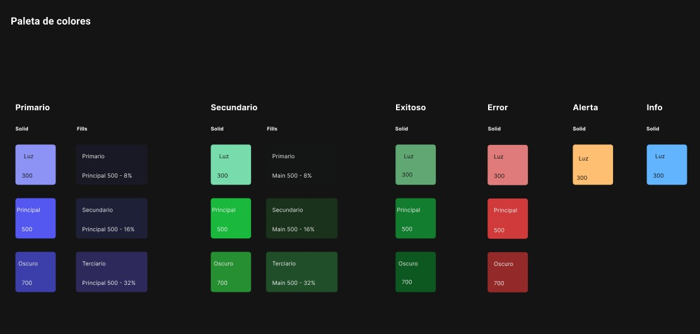

### Tipografía

Se emplean las fuentes **Manrope** e **Inter** para establecer una jerarquía visual consistente.

Manrope se utiliza principalmente en títulos, encabezados y elementos de marca, debido a su apariencia moderna y sus trazos definidos. Por su parte, Inter se utiliza en párrafos, descripciones y elementos de navegación, favoreciendo una lectura clara tanto en computadoras como en dispositivos móviles.

La jerarquía tipográfica se establece mediante variaciones de tamaño y grosor. Los títulos principales presentan mayor tamaño y peso visual, mientras que los subtítulos y textos descriptivos mantienen proporciones menores para facilitar el recorrido de lectura.

**Figura 3. Aplicación de las tipografías Manrope e Inter en FleetProof.**

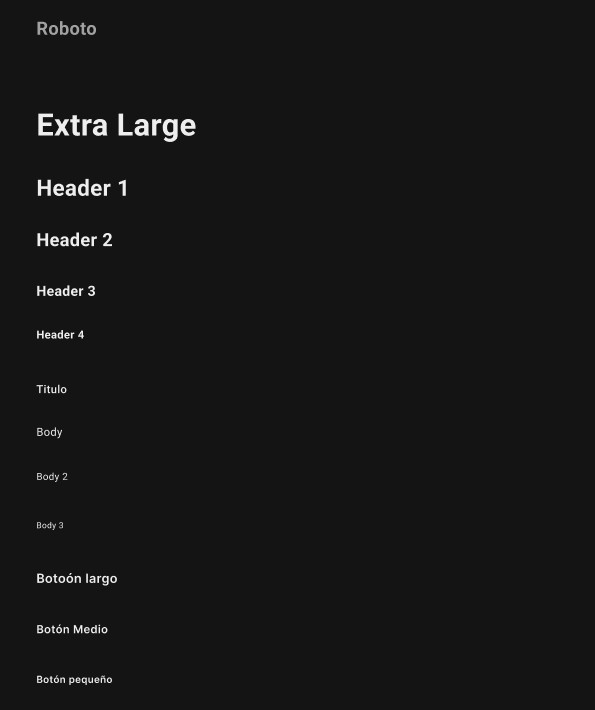

### Espaciado y composición

El diseño utiliza espacios en blanco para separar las diferentes secciones y evitar la saturación visual. Se establece un contenedor principal de hasta 1180 píxeles de ancho, acompañado de márgenes y espaciados que se adaptan al tamaño de la pantalla.

Las tarjetas de contenido presentan bordes redondeados, sombras suaves y una distribución uniforme. Estos elementos permiten agrupar visualmente información relacionada, como los beneficios del producto, las soluciones para cada segmento y los planes de suscripción.

La organización de los componentes mantiene una separación consistente entre títulos, descripciones, imágenes y botones, permitiendo que los usuarios identifiquen fácilmente los diferentes bloques de información.

### Iconografía y elementos gráficos

Se utilizan iconos vectoriales SVG de estilo simple, asociados a las funcionalidades del producto, como el ahorro de tiempo, la seguridad, la trazabilidad y la colaboración.

Asimismo, se incorporan imágenes de vehículos y una vista previa del dashboard para representar visualmente la solución y facilitar la comprensión de sus funcionalidades.

Los elementos gráficos mantienen una línea visual consistente con la paleta cromática y el estilo minimalista de la plataforma.

### Tono de comunicación

FleetProof adopta un tono de comunicación claro, profesional y orientado a la prevención. Los mensajes destacan beneficios concretos, como reducir la incertidumbre, identificar observaciones y mantener un seguimiento continuo del estado vehicular.

La comunicación evita presentar la plataforma como una entidad oficial y enfatiza la importancia de conservar la fuente, fecha y evidencia de cada resultado.

De esta manera, la identidad visual y verbal se fundamenta en tres principios: claridad de la información, trazabilidad de los resultados y facilidad de uso.

---
 
### 4.1.2 Web Style Guidelines

Los lineamientos de estilo web de FleetProof establecen criterios para mantener una interfaz consistente, adaptable y accesible tanto en la landing page como en el diseño de la aplicación web.

La interfaz se basa en una distribución modular, donde la información se presenta mediante secciones, tarjetas, botones, tablas y componentes reutilizables. Esta estructura permite organizar los elementos de acuerdo con su importancia y mantener una experiencia visual coherente en las distintas pantallas del producto.

### Diseño responsive

La landing page utiliza un diseño adaptable mediante CSS Grid, Flexbox y media queries. Se consideran diferentes puntos de adaptación, principalmente a los 1080, 900 y 650 píxeles de ancho.

En pantallas de escritorio, los componentes se distribuyen en varias columnas. En tabletas, las secciones se reorganizan y el menú principal se reemplaza por un menú desplegable a partir de determinados tamaños. En dispositivos móviles, las tarjetas se presentan verticalmente y los botones principales ocupan el ancho disponible para facilitar su interacción.

Los planes de suscripción también adaptan su distribución, pasando de tres columnas en escritorio a dos en tabletas y una en dispositivos móviles.

### Componentes y botones

Se establecen componentes visuales reutilizables, como tarjetas informativas, tarjetas de planes, etiquetas, encabezados y botones de acción.

Los botones principales utilizan un fondo azul con texto blanco para destacar acciones prioritarias, mientras que los botones secundarios presentan un fondo blanco con bordes azules.

Las acciones deben mantener estados visuales consistentes, incluyendo:

- **Estado normal:** presentación predeterminada del componente.
- **Estado hover:** cambio visual cuando el usuario posiciona el cursor sobre el elemento.
- **Estado focus:** indicador visual cuando el componente recibe el foco mediante el teclado.
- **Estado disabled:** presentación diferenciada cuando una acción no se encuentra disponible.

Estos estados permiten identificar los elementos interactivos y reconocer su comportamiento.
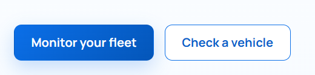

### Formularios y validaciones

Para la aplicación web se propone utilizar formularios con campos claramente identificados, etiquetas descriptivas y mensajes de validación comprensibles.

Estos componentes permitirán registrar vehículos, consultar información mediante placas, gestionar cuentas y configurar suscripciones.

Los formularios deberán diferenciar visualmente los campos obligatorios y presentar mensajes de error específicos cuando se introduzcan datos incorrectos o incompletos.

Asimismo, las validaciones deberán comunicar claramente la causa del error y orientar al usuario sobre cómo corregirlo.

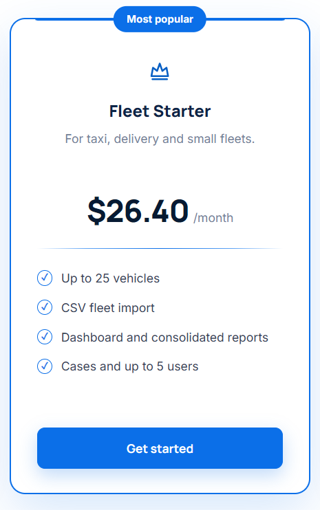

### Tablas y visualización de información

La landing page incorpora una tabla comparativa que presenta las diferencias entre un reporte tradicional y FleetProof. Esta tabla utiliza encabezados diferenciados, filas organizadas y desplazamiento horizontal cuando el ancho de la pantalla es reducido.

El mismo criterio se propone para las tablas de la aplicación web, destinadas a visualizar vehículos, reportes, alertas y casos de seguimiento.

Estas deberán presentar información organizada, encabezados descriptivos y una distribución que facilite la identificación de registros.

**Figura 7. Tabla comparativa presentada en la landing page de FleetProof.**

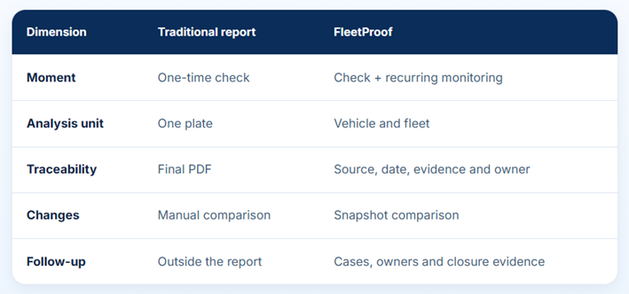

*Fuente: Elaboración propia.*

### Alertas y mensajes de retroalimentación

La interfaz contempla mensajes emergentes para informar al usuario sobre determinadas acciones. En la landing page se utilizan notificaciones temporales y ventanas modales para mostrar información y avisos legales.

Para la aplicación web se propone mantener este patrón de retroalimentación mediante los siguientes tipos de mensajes:

- **Confirmación:** informa que una operación se realizó correctamente.
- **Advertencia:** comunica una situación que requiere atención.
- **Error:** indica que una operación no pudo completarse.
- **Información:** presenta mensajes complementarios relacionados con una acción.

Cada mensaje deberá explicar claramente la situación y, cuando corresponda, indicar la acción necesaria para continuar.

### Accesibilidad

Se establecen criterios de accesibilidad orientados a facilitar el uso de la plataforma.

La landing page incorpora etiquetas descriptivas, textos alternativos para imágenes, indicadores de foco, navegación mediante teclado y un enlace para saltar directamente al contenido principal.

Asimismo, se contempla la preferencia del usuario por reducir las animaciones, evitando efectos de movimiento innecesarios.

Estas características constituyen la base para desarrollar una aplicación web que priorice la legibilidad, la navegación y la comprensión de la información.

---

## 4.2 Information Architecture

La arquitectura de información de FleetProof tiene como objetivo organizar los contenidos y funcionalidades de manera lógica, permitiendo que los usuarios encuentren fácilmente la información que necesitan y accedan a las operaciones relacionadas con la consulta y el monitoreo vehicular.

La estructura considera dos segmentos principales: empresas que administran flotas vehiculares y usuarios particulares interesados en consultar el historial y estado de un vehículo.

A partir de esta diferenciación, se establecen sistemas de organización y etiquetado que facilitan la navegación y permiten presentar información relevante para cada tipo de usuario.

---
### 4.2.1 Organization Systems

FleetProof utiliza un sistema de organización jerárquico y secuencial que permite estructurar la información según su importancia, funcionalidad y público objetivo.

En la landing page, la información se presenta mediante una secuencia que introduce al usuario en la propuesta de valor del producto, explica sus principales beneficios, diferencia las soluciones disponibles y finaliza con las opciones para comenzar a utilizar la plataforma.

### Organización jerárquica

La arquitectura de la landing page presenta una estructura jerárquica que organiza la información desde los contenidos generales hasta las funcionalidades específicas.

La navegación principal permite acceder a las siguientes secciones:

- **Inicio:** presenta la propuesta de valor y los principales beneficios de FleetProof.
- **Producto:** describe las características y funcionalidades principales de la plataforma.
- **Soluciones:** presenta los servicios dirigidos a los diferentes segmentos de usuarios.
- **Planes:** muestra las alternativas de suscripción disponibles.
- **Cómo funciona:** explica el proceso de utilización de la plataforma.
- **Nosotros:** presenta información relacionada con el equipo desarrollador.

Esta estructura permite que los visitantes accedan directamente a la información de su interés sin necesidad de recorrer toda la página.

**Figura 8. Estructura de navegación y organización jerárquica de FleetProof.**

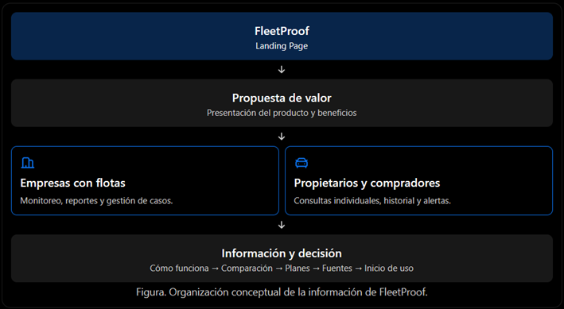

### Organización por audiencia

La estructura de navegación se complementa con un sistema de organización por audiencia, que diferencia las necesidades de los dos segmentos del producto.

**Segmento 1: Empresas con flotas vehiculares**

Para este segmento se priorizan las funcionalidades relacionadas con:

- Monitoreo continuo de vehículos.
- Visualización del estado de la flota.
- Gestión y seguimiento de alertas.
- Asignación de responsables.
- Generación de reportes consolidados.

Esta organización permite que las empresas centralicen la información vehicular y realicen un seguimiento de las observaciones identificadas.

**Segmento 2: Propietarios y compradores de vehículos**

Para este segmento se priorizan las siguientes funcionalidades:

- Consultas individuales de vehículos.
- Revisión del historial vehicular.
- Interpretación de hallazgos.
- Seguimiento de cambios relevantes.
- Generación de reportes individuales.

La organización propuesta busca facilitar el acceso a la información necesaria para conocer el estado de un vehículo y realizar consultas con mayor claridad.

### Organización secuencial

La sección "Cómo funciona" utiliza una organización secuencial que explica progresivamente el proceso de utilización del producto.

El flujo se estructura en cuatro etapas:

1. **Registrar vehículos:** incorporar los vehículos que serán consultados o monitoreados.
2. **Revisar fuentes:** consultar y organizar la información disponible de las fuentes correspondientes.
3. **Comparar y priorizar:** analizar los resultados obtenidos e identificar observaciones relevantes.
4. **Resolver con evidencias:** realizar el seguimiento de las observaciones y conservar información que respalde su resolución.

---

### 4.2.2 Labeling Systems

El sistema de etiquetado de FleetProof establece nombres claros, breves y consistentes para identificar las secciones, funcionalidades y acciones disponibles en la plataforma.

Se prioriza el uso de términos comprensibles para los usuarios, evitando tecnicismos innecesarios y empleando palabras relacionadas directamente con las actividades que podrán realizar.

### Etiquetado de la landing page

En la landing page se utilizan etiquetas descriptivas para organizar el menú principal, tales como "Producto", "Soluciones", "Planes", "Cómo funciona" y "Nosotros".

Estas etiquetas permiten identificar rápidamente el contenido de cada sección.

Asimismo, las acciones principales utilizan expresiones directas, como "Monitorea tu flota", "Consulta un vehículo", "Iniciar sesión" y "Comenzar", facilitando que cada segmento identifique la opción correspondiente a su necesidad.

La landing page también incorpora un selector de idioma que permite alternar entre español e inglés, manteniendo la equivalencia de las etiquetas y los mensajes en ambos idiomas.

### Etiquetado de la aplicación web

Para la aplicación web, se propone mantener la misma terminología mediante un sistema de etiquetado basado en las funcionalidades principales.

| Etiqueta | Descripción |
|---|---|
| Dashboard | Vista general del estado de los vehículos y principales indicadores. |
| Vehículos | Registro y administración de vehículos. |
| Reportes | Consulta y generación de reportes vehiculares. |
| Alertas | Notificaciones sobre cambios y observaciones relevantes. |
| Casos | Gestión y seguimiento de incidencias. |
| Historial | Consulta de resultados y verificaciones anteriores. |
| Suscripciones | Administración de los planes contratados. |
| Configuración | Gestión de preferencias y datos de la cuenta. |

Las etiquetas deberán mantener consistencia entre los menús, encabezados, botones y mensajes informativos de la aplicación.

### Etiquetado de acciones

Las etiquetas de acción seguirán una estructura basada en verbos, con la finalidad de comunicar de manera directa el resultado esperado de cada interacción.

Entre las principales etiquetas propuestas se encuentran:

- **Registrar vehículo:** permite incorporar un nuevo vehículo a la plataforma.
- **Generar reporte:** inicia el proceso de generación de información vehicular.
- **Ver detalles:** permite consultar información adicional de un registro.
- **Asignar responsable:** permite designar a un usuario para el seguimiento de un caso.
- **Cerrar caso:** finaliza el seguimiento de una observación.

Para los estados de los vehículos y las incidencias, se propone utilizar etiquetas que describan claramente su situación, evitando depender únicamente de colores o símbolos para transmitir información.

De esta manera, el sistema de etiquetado contribuirá a mantener una navegación intuitiva y un lenguaje uniforme entre la landing page y la aplicación web, reduciendo la ambigüedad y facilitando el reconocimiento de las diferentes funcionalidades.

### 4.2.3 SEO Tags and Meta Tags

FleetProof establece una estrategia de optimización para motores de búsqueda (SEO) orientada a mejorar la identificación de la plataforma en Internet y facilitar que los usuarios interesados en reportes vehiculares y monitoreo de flotas encuentren el producto.

Para ello, se definen etiquetas HTML que describen el contenido de la landing page, identifican al equipo desarrollador y permiten presentar información relevante en los resultados de búsqueda.

Se propone utilizar las siguientes etiquetas:

| Page | Title | Description | Keywords | Author |
|---|---|---|---|---|
| Landing Page | FleetProof \| Reportes vehiculares y monitoreo de flotas | Plataforma de consulta y monitoreo vehicular que permite generar reportes, identificar alertas y gestionar el seguimiento de vehículos y flotas en Perú. | FleetProof, reportes vehiculares, consulta vehicular, monitoreo de flotas, historial vehicular, Perú | BLIP |

La etiqueta **Title** identifica el nombre del producto y su funcionalidad principal. Por su parte, la etiqueta **Description** presenta un resumen de la propuesta de valor de FleetProof, destacando la consulta vehicular, la generación de reportes y el monitoreo continuo.

Las palabras clave definidas representan los conceptos principales del producto y sirven como referencia para la redacción del contenido. Se considera que la etiqueta `meta keywords` no influye en el posicionamiento de Google, por lo que la estrategia SEO prioriza los títulos descriptivos, el contenido relevante y las descripciones de cada página.

Adicionalmente, se establecen los siguientes metadatos:

| Meta Tag | Propósito |
|---|---|
| Charset | Establecer la codificación UTF-8 para visualizar correctamente los caracteres. |
| Viewport | Adaptar la visualización de la página a diferentes dispositivos. |
| Description | Describir brevemente el contenido de la página. |
| Author | Identificar a BLIP como equipo desarrollador. |
| Open Graph | Definir el título, descripción e imagen que se mostrarán al compartir el enlace en redes sociales. |
| Canonical | Identificar la URL principal de la landing page. |
| Robots | Definir las directivas de indexación aplicables a las páginas públicas. |

La URL principal de la landing page es:

https://danielpm23.github.io/fleetproof-preview/

Se propone mantener metadatos diferenciados según el idioma del contenido. Asimismo, los módulos privados de la aplicación web, como el dashboard y los reportes asociados a cuentas de usuario, deberán permanecer fuera de la indexación pública mediante mecanismos apropiados, sin depender de dichas etiquetas como medida de seguridad.

### 4.2.4 Searching Systems

El sistema de búsqueda de FleetProof tiene como finalidad facilitar la localización de vehículos, reportes, alertas y casos de seguimiento dentro de la aplicación web.

Se propone implementar un sistema de búsqueda combinada que permita consultar información mediante identificadores específicos y aplicar filtros de acuerdo con las necesidades de cada segmento de usuarios.

Para las empresas que administran flotas, el sistema permitirá localizar vehículos y consultar observaciones mediante diferentes criterios. Para los propietarios y compradores, se priorizará la búsqueda individual mediante la placa del vehículo y la consulta de los reportes asociados.

Los criterios de búsqueda definidos son los siguientes:

| Criterio | Descripción | Tipo de búsqueda |
|---|---|---|
| Placa | Permite localizar un vehículo mediante su número de placa. | Campo de texto. |
| Estado | Filtra vehículos o casos según su situación actual. | Lista desplegable. |
| Severidad | Permite identificar observaciones según su nivel de importancia. | Lista desplegable. |
| Fecha | Permite consultar registros correspondientes a un periodo determinado. | Selector de rango de fechas. |
| Sede | Permite visualizar los vehículos pertenecientes a una sede de la empresa. | Lista desplegable. |
| Responsable | Permite identificar vehículos o casos asignados a un usuario específico. | Lista desplegable. |

**Búsqueda por placa**

Se establece como el mecanismo principal para localizar vehículos dentro de FleetProof.

El usuario podrá ingresar el número de placa en un campo de búsqueda. El sistema deberá normalizar el valor ingresado, eliminando espacios innecesarios y unificando el uso de mayúsculas, para facilitar la identificación del vehículo.

Los resultados deberán presentar la información correspondiente a los vehículos que el usuario tenga autorización para consultar.

**Búsqueda mediante filtros**

El sistema permitirá combinar diferentes criterios para obtener resultados específicos.

Por ejemplo, un administrador de flota podrá consultar los vehículos pertenecientes a una sede determinada, que presenten observaciones de severidad alta y que se encuentren asignados a un responsable.

Los filtros se aplicarán de manera conjunta y podrán restablecerse mediante una opción que permita regresar al listado general.

Los valores de estado y severidad se definirán de acuerdo con las reglas de negocio del producto, manteniendo consistencia entre las tablas, reportes y alertas.

**Presentación de resultados**

Los resultados se organizarán mediante tablas y tarjetas informativas, mostrando únicamente los campos relevantes para la consulta.

Cada registro podrá incluir información como placa, estado, fecha de última revisión, observaciones y acciones disponibles.

Cuando no se encuentren coincidencias, la interfaz mostrará un mensaje informativo y ofrecerá la posibilidad de modificar los filtros o realizar una nueva búsqueda.

Asimismo, los listados extensos deberán incorporar paginación para facilitar la navegación entre los resultados.

**Búsqueda según el segmento de usuario**

El sistema de búsqueda se adaptará a las funcionalidades disponibles para cada segmento:

- **Empresas con flotas:** búsqueda por placa, estado, severidad, fecha, sede y responsable.
- **Propietarios y compradores:** búsqueda por placa y consulta de reportes e historial de los vehículos autorizados.

Esta diferenciación permitirá reducir la complejidad de la interfaz y presentar únicamente las opciones necesarias para cada tipo de usuario.

El sistema también deberá respetar los permisos asociados a cada cuenta, evitando mostrar vehículos, reportes o casos que no correspondan al usuario autenticado.

### 4.2.5 Navigation Systems

El sistema de navegación de FleetProof tiene como objetivo permitir que los usuarios accedan a las diferentes secciones y funcionalidades de manera intuitiva, manteniendo una estructura consistente entre la landing page y la aplicación web.

Se establecen dos sistemas de navegación principales: navegación pública, orientada a presentar el producto, y navegación privada, destinada a las operaciones de consulta y gestión vehicular.

#### Navegación de la Landing Page

La landing page utiliza un sistema de navegación horizontal en su versión de escritorio, ubicado en la parte superior de la interfaz.

Este menú permite acceder directamente a las secciones informativas del producto y facilita que los visitantes conozcan sus características, soluciones y alternativas de suscripción.

La estructura del menú principal comprende las siguientes secciones:

| Sección | Descripción |
|---|---|
| Producto | Presenta las características y beneficios principales de FleetProof. |
| Soluciones | Describe las funcionalidades dirigidas a empresas y particulares. |
| Planes | Muestra las alternativas de suscripción disponibles. |
| Cómo funciona | Explica el proceso de consulta y seguimiento vehicular. |
| Nosotros | Presenta información sobre FleetProof y el equipo desarrollador. |

La navegación se complementa con botones de llamada a la acción, como "Monitorea tu flota", "Consulta un vehículo", "Iniciar sesión" y "Comenzar".

Estos botones están orientados a dirigir al usuario hacia la funcionalidad correspondiente o al proceso de acceso a la plataforma.

En dispositivos móviles, el menú horizontal se reemplaza por un menú desplegable que permite acceder a las mismas secciones sin ocupar excesivo espacio en pantalla.

Adicionalmente, se mantiene el logotipo como elemento de identificación y referencia para regresar al inicio de la landing page.

#### Navegación de la Web Application

Para la aplicación web se propone implementar un sistema de navegación lateral o sidebar, que permitirá acceder a los módulos funcionales disponibles según el tipo de usuario.

El sidebar estará ubicado en el lado izquierdo de la interfaz en su versión de escritorio y podrá contraerse en pantallas de menor tamaño.

La navegación se organizará mediante etiquetas descriptivas e iconos representativos que faciliten el reconocimiento de las funcionalidades.

Los módulos propuestos son los siguientes:

| Módulo | Funcionalidad |
|---|---|
| Dashboard | Visualización general de indicadores y estado vehicular. |
| Vehículos | Registro, consulta y administración de vehículos. |
| Reportes | Consulta y generación de reportes vehiculares. |
| Alertas | Visualización de observaciones y notificaciones. |
| Casos | Gestión y seguimiento de incidencias. |
| Historial | Consulta de verificaciones y resultados anteriores. |
| Suscripciones | Administración del plan contratado. |
| Configuración | Administración de preferencias y datos de la cuenta. |

La interfaz destacará visualmente el módulo seleccionado para que el usuario identifique su ubicación actual.

Asimismo, se propone incorporar rutas de navegación jerárquica o breadcrumbs en aquellas pantallas que presenten diferentes niveles de profundidad, como la visualización del detalle de un vehículo o de un reporte.

#### Navegación por segmento de usuario

FleetProof contempla dos segmentos principales, por lo que la navegación deberá adaptarse a las necesidades y permisos asociados a cada uno.

**Segmento 1: Empresas con flotas vehiculares**

Este segmento dispondrá de una navegación orientada a la administración y supervisión de múltiples vehículos.

Se propone el siguiente recorrido:

1. Iniciar sesión en FleetProof.
2. Acceder al dashboard de la flota.
3. Consultar el listado de vehículos.
4. Seleccionar un vehículo para visualizar su información.
5. Revisar reportes y alertas.
6. Gestionar los casos y registrar evidencias.

El sistema permitirá que los usuarios autorizados accedan a las herramientas administrativas correspondientes a sus responsabilidades.

**Segmento 2: Propietarios y compradores**

Este segmento dispondrá de una navegación simplificada, orientada a la consulta individual de información vehicular.

Se propone el siguiente recorrido:

1. Acceder a FleetProof.
2. Iniciar sesión o continuar con el proceso de consulta correspondiente.
3. Ingresar la placa del vehículo.
4. Solicitar o consultar el reporte disponible.
5. Revisar los resultados y observaciones.
6. Consultar el historial o configurar el seguimiento, según el servicio contratado.

Esta organización permitirá que cada segmento encuentre las funcionalidades relacionadas con sus objetivos, evitando presentar módulos innecesarios.

#### Propuesta de rutas de navegación

Como parte del diseño de la aplicación web, se establece una estructura de rutas que diferencia el acceso público de los módulos privados.

| Ruta propuesta | Funcionalidad | Acceso |
|---|---|---|
| `/` | Landing Page | Público |
| `/login` | Inicio de sesión | Público |
| `/register` | Registro de usuarios | Público |
| `/app/dashboard` | Panel principal | Autenticado |
| `/app/vehicles` | Gestión de vehículos | Autenticado |
| `/app/reports` | Gestión de reportes | Autenticado |
| `/app/alerts` | Consulta de alertas | Autenticado |
| `/app/cases` | Gestión de casos | Autenticado y autorizado |
| `/app/subscriptions` | Gestión de suscripciones | Autenticado |
| `/app/settings` | Configuración de cuenta | Autenticado |

Estas rutas representan una propuesta de organización para el desarrollo de la aplicación web y podrán ajustarse de acuerdo con la arquitectura y los requerimientos funcionales definidos.

El acceso a cada módulo deberá controlarse mediante autenticación y autorización, considerando el segmento, el rol y los permisos del usuario.

Finalmente, el sistema de navegación deberá mantener consistencia visual entre las diferentes pantallas, permitir el retorno a las secciones anteriores y conservar el contexto de navegación cuando sea necesario.

## 4.3 Landing Page UI Design

### 4.3.1 Landing Page Wireframe

Este wireframe representa la estructura de la landing page de FleetProof, incluyendo la disposición de los elementos, la jerarquía visual y la organización de las secciones principales.

### 4.3.2 Landing Page Mock-up
Este mock-up representa la propuesta de diseño visual de la landing page de FleetProof, incluyendo la disposición de los elementos, la paleta de colores, la tipografía y los componentes interactivos.

Enlace de figma:
## 4.4 Web Applications UX/UI Design
La propuesta de UX/UI de FleetProof se desarrolla desde un enfoque centrado en la trazabilidad de las decisiones vehiculares. Más allá de presentar información sobre el estado de un vehículo, se busca que los usuarios puedan comprender los resultados de una consulta, identificar cambios documentarios y reconocer las acciones necesarias para atender posibles observaciones.

Para el segmento empresarial, el diseño prioriza la continuidad entre la visualización general de la flota, la consulta del historial vehicular, la comparación de reportes y la asignación de responsabilidades. De esta manera, cada interacción se relaciona con una necesidad concreta de gestión y seguimiento.

En esta sección se presentan los wireframes, wireflows, mock-ups y diagramas de flujo de usuario que representan la estructura, navegación y comportamiento propuesto para la aplicación web. Estos artefactos permiten analizar la coherencia entre las pantallas y las tareas del usuario, estableciendo una base para las posteriores etapas de desarrollo y validación.

### 4.4.1 Web Applications Wireframes
 
La figura presenta la propuesta estructural de la interfaz de FleetProof, utilizada como referencia para organizar las funcionalidades de consulta y gestión vehicular. Esta representación permite analizar la distribución de los contenidos y la relación entre los elementos de navegación antes de desarrollar los mock-ups de alta fidelidad.

Su incorporación contribuye a establecer una base visual para evaluar la claridad de los recorridos del usuario y la consistencia entre las pantallas que conforman el sistema.

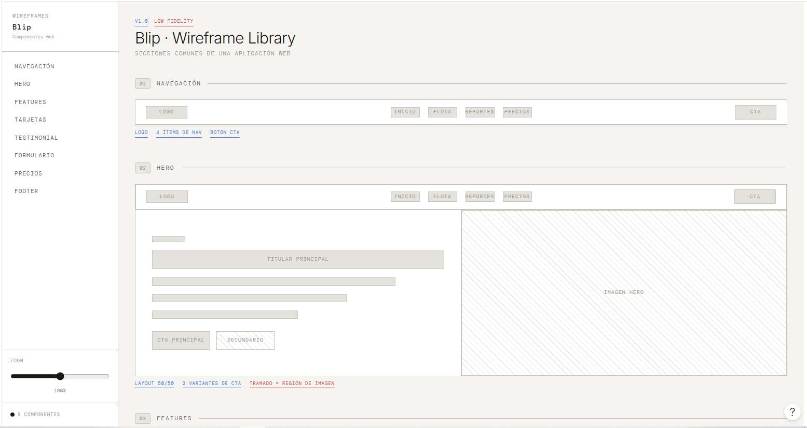

*Fuente: Elaboración propia del equipo FleetProof.*
### 4.4.2 Web Applications Wireflow Diagrams

El siguiente wireflow presenta la navegación de la aplicación web de FleetProof para la gestión de flotas. Se muestran las conexiones entre el dashboard, el detalle de vehículos, la comparación de reportes y la creación de casos de regularización.

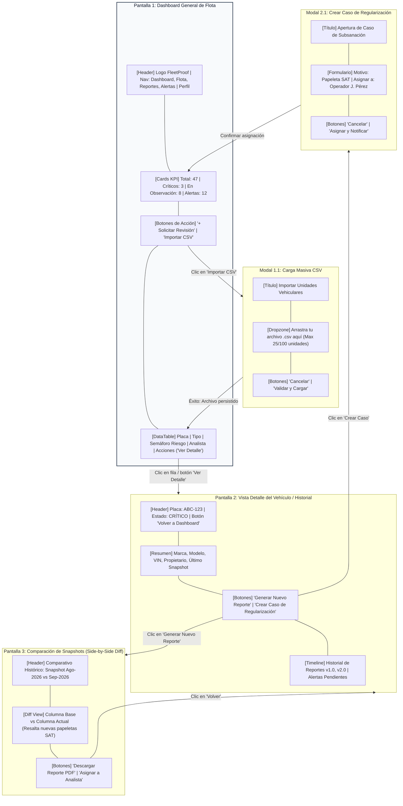

### 4.4.3 Web Applications Mock-ups

Los siguientes mock-ups presentan el diseño visual de la aplicación web de FleetProof. Se muestran las principales interfaces del sistema, considerando la organización de la información vehicular, la navegación y las funcionalidades disponibles para la gestión y el monitoreo de flotas.

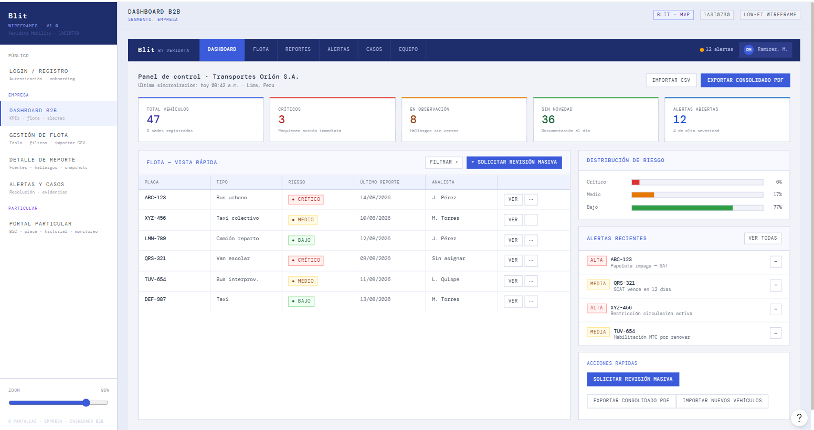
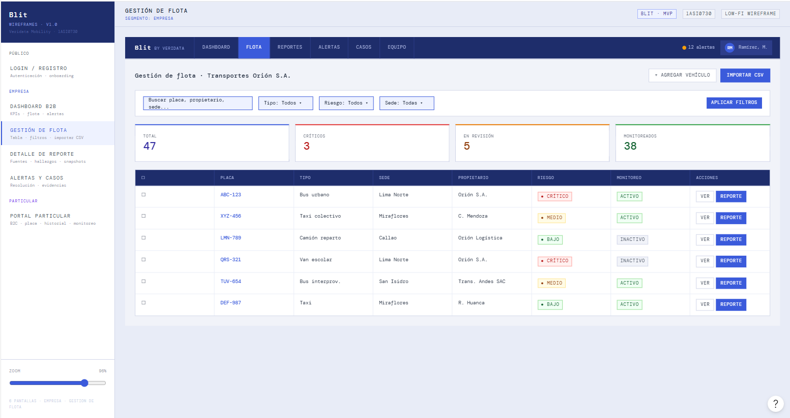
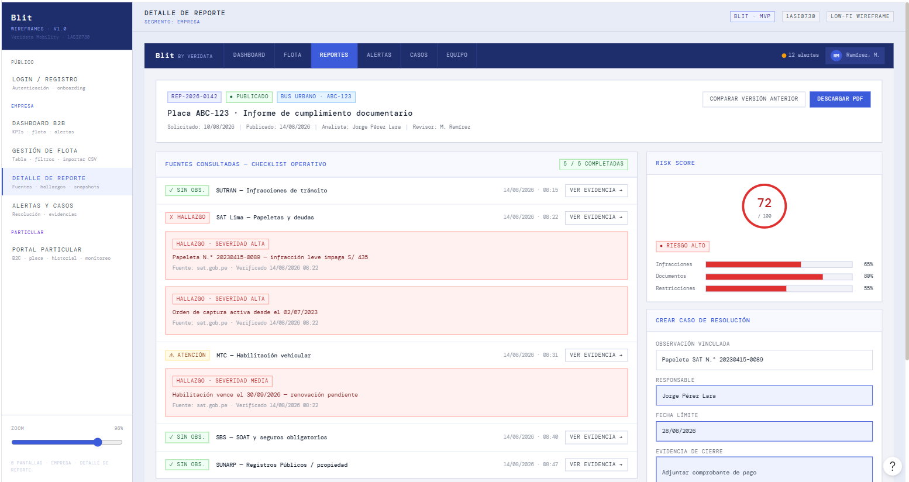
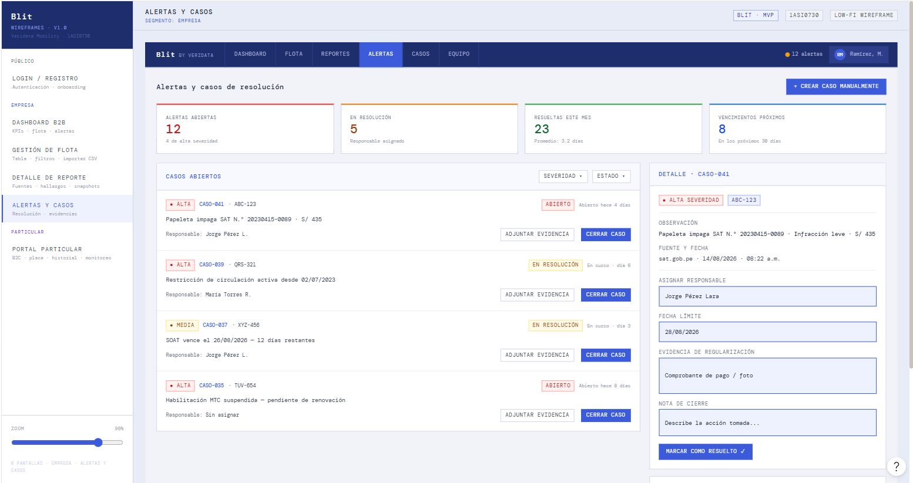

### 4.4.4 Web Applications User Flow Diagrams

El siguiente diagrama de flujo representa el proceso de importación masiva de vehículos en FleetProof. Se detallan las acciones del usuario y las validaciones del sistema, considerando el formato del archivo CSV, la verificación de placas y los límites del plan contratado, hasta completar el registro de la flota.

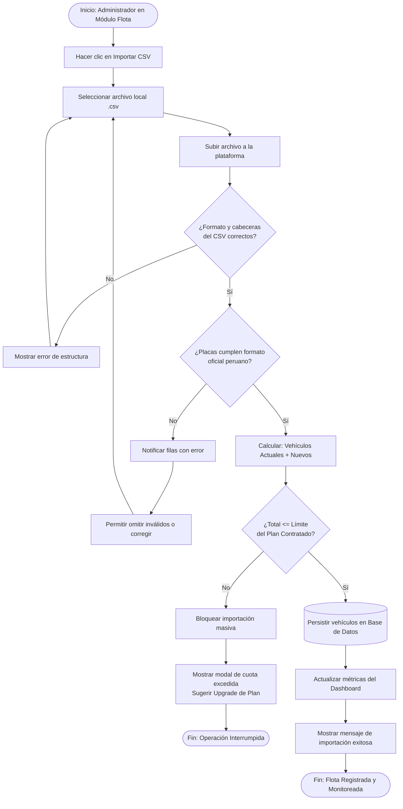

## 4.5 Web Applications Prototyping

El prototipo de FleetProof permite visualizar la propuesta interactiva de la aplicación web, integrando las pantallas y los flujos definidos anteriormente. Su desarrollo en Figma facilita la exploración de la navegación y las principales funcionalidades del sistema antes de su implementación.

https://www.figma.com/make/LkD3mKP9wjNjnOPTRRzoCt/Create-web-wireframes?p=f&fullscreen=1

## 4.6 Domain-Driven Software Architecture

En esta sección se presenta la arquitectura de software de FleetProof, aplicando los principios de Domain-Driven Design (DDD). Mediante el Event Storming y los diagramas de arquitectura, se identifican los principales procesos del negocio, los componentes del sistema y sus interacciones, estableciendo una estructura organizada para el desarrollo de la plataforma.

### 4.6.1 Design-Level Event Storming

El Design-Level Event Storming de FleetProof permite representar los principales eventos, comandos y procesos del dominio vehicular. A través de diez etapas, se identifican los problemas, reglas de negocio, sistemas externos y contextos delimitados que intervienen en el funcionamiento de la plataforma.

Step 1: Unstructured Exploration

Step 2: Timelines

Step 3: Pain Points

Step 4: Pivotal Points

Step 5: Commands

Step 6: Policies

Step 7: Read Models

Step 8: External Systems

Step 9: Aggregates

Step 10: Bounded Contexts

### 4.6.2 Software Architecture Context Diagram

TODO: Insertar C4 Context Diagram.

### 4.6.3 Software Architecture Container Diagrams

TODO: Insertar C4 Container Diagram.

### 4.6.4 Software Architecture Components Diagrams

TODO: Insertar C4 Component Diagrams.

## 4.7 Software Object-Oriented Design

### 4.7.1 Class Diagrams

TODO: Insertar class diagrams por bounded context.

## 4.8 Database Design

### 4.8.1 Database Diagrams

TODO: Insertar database diagrams con tablas, columnas, constraints y relaciones.

