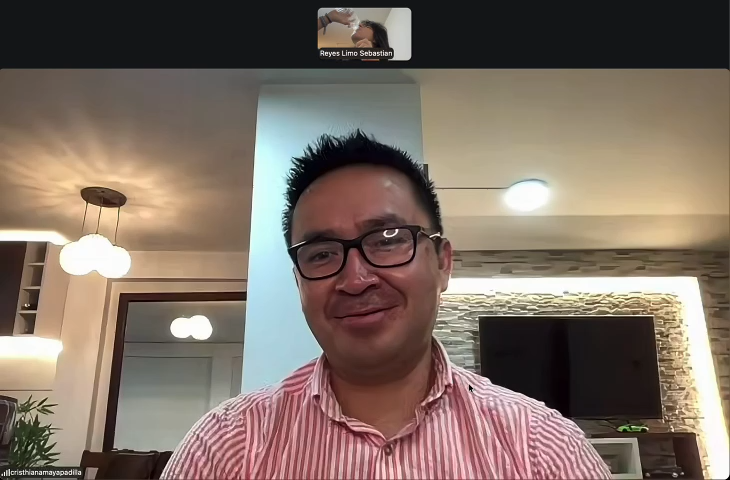
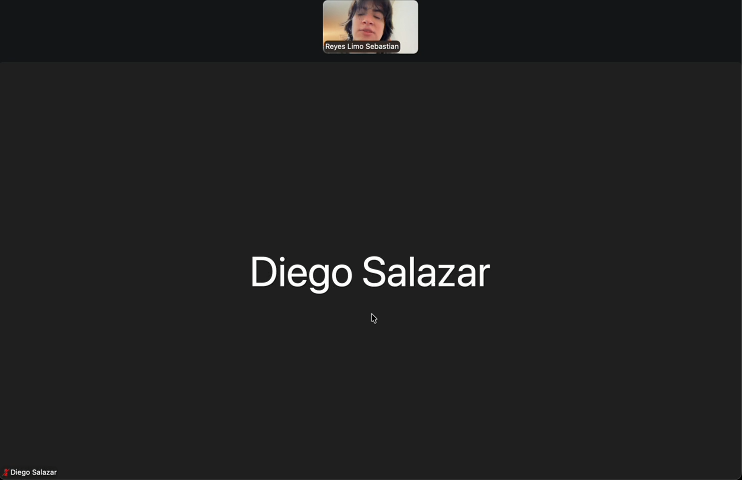
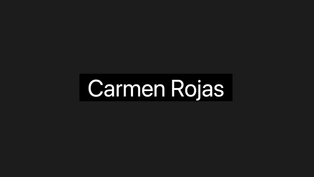
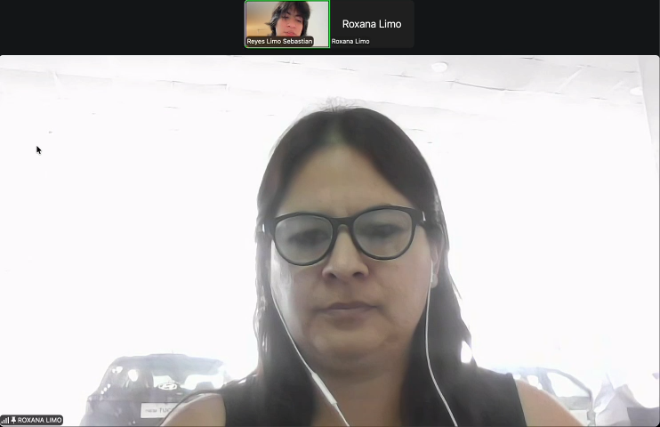
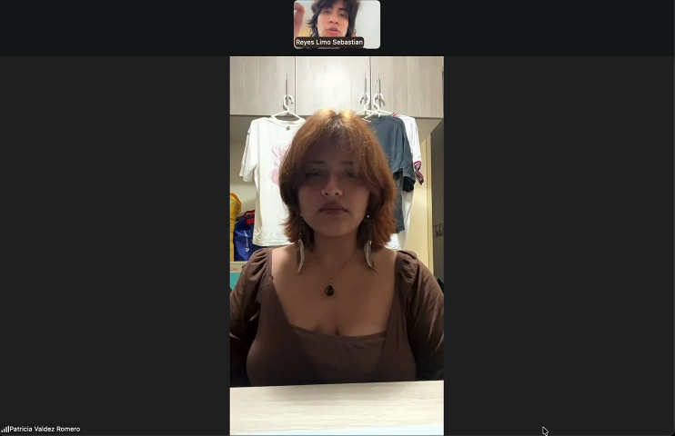
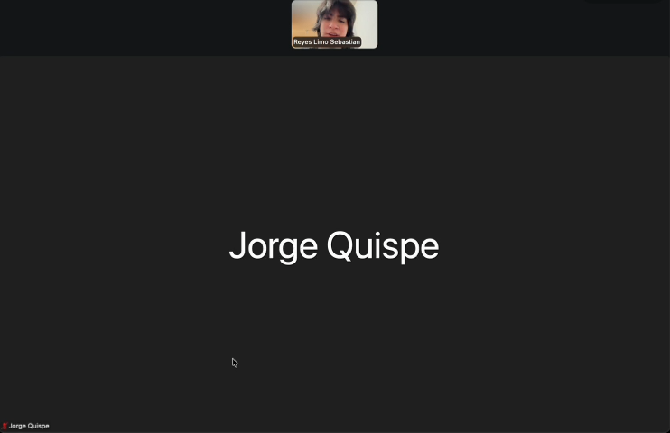
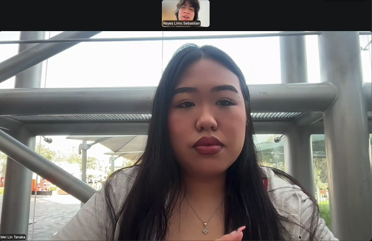
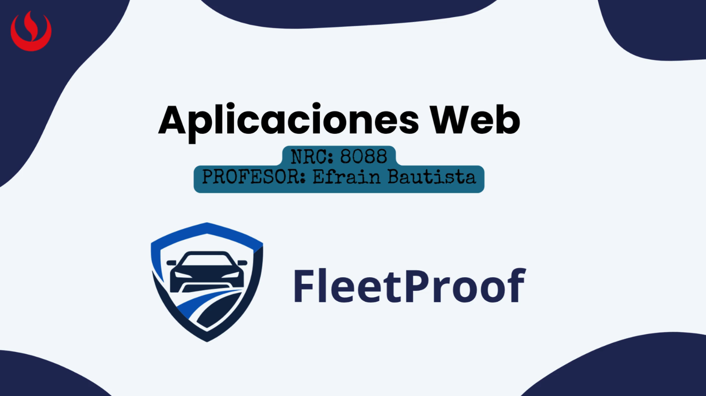

# Anexos

## Anexo A: Videos de Exposiciones

| Entrega | Video | URL del video | Duración |
|---|---|---|---|
| AV1 | [Exposición AV1 - BLIP FleetProof](https://drive.google.com/file/d/1FLNnxTZTzsK9Y0VTbScm8yhSiuJtYtqe/view?usp=sharing) | Google Drive | 21 min 54 s |
| TB1 | Pendiente para esa entrega | Pendiente para esa entrega | Pendiente para esa entrega |
| AV2 | Pendiente para esa entrega | Pendiente para esa entrega | Pendiente para esa entrega |
| TB2 | Pendiente para esa entrega | Pendiente para esa entrega | Pendiente para esa entrega |

El video AV1 corresponde al nombre de archivo `upc-pre-202620-1asi0730-8088-BLIP-expo-av1.mp4` según la convención del curso.

## Anexo B: Needfinding Interviews

Carpeta de evidencias: [Entrevistas BLIP en Google Drive](https://drive.google.com/drive/folders/1J_CH36gLPBuRfEddE-mYVSuRtR42PupA?usp=sharing)

Se realizaron siete entrevistas distribuidas en los dos segmentos objetivo. El resumen de cada entrevista y el análisis por segmento se encuentran en el [Capítulo II: Requirements Elicitation & Analysis](03-chapter-2-requirements-elicitation-analysis.md).

| # | Entrevistado | Segmento | Fecha | Video | Timing analizado | Duración total | Screenshot |
|---|---|---|---|---|---|---|---|
| 1 | Cristhian Amaya | Propietarios, compradores y asesores automotores | 14/09/2026 | [Video](https://drive.google.com/file/d/1vuK3760hfVoZ6iQ2w8zH8JjX1x1xN4wV/view?usp=sharing) | 00:00-04:59 | 06:09 |  |
| 2 | Diego Salazar | Propietarios, compradores y asesores automotores | 14/09/2026 | [Video](https://drive.google.com/file/d/1WOgmq7SrvhCsfrzepEs4MYiihV_H29So/view?usp=sharing) | 00:00-02:53 | 02:53 |  |
| 3 | Carmen Rojas | Propietarios, compradores y asesores automotores | 14/09/2026 | [Video](https://drive.google.com/file/d/1oC_IIEz323KG5xMw2XBtcArW4iBLHnSo/view?usp=sharing) | 00:00-02:21 | 02:21 |  |
| 4 | Roxana Limo | Responsables comerciales, logísticos y flotas pequeñas | 14/09/2026 | [Video](https://drive.google.com/file/d/162TzcnpSq3aFRJ9C3_9D3Boq27fG1iA2/view?usp=sharing) | 00:00-04:59 | 11:47 |  |
| 5 | Patricia Valdez | Responsables comerciales, logísticos y flotas pequeñas | 14/09/2026 | [Video](https://drive.google.com/file/d/1xHdo7dU-W5I4Iyjdo4MMCZ1lm9HqCnv_/view?usp=sharing) | 00:00-02:14 | 02:14 |  |
| 6 | Jorge Quispe | Responsables comerciales, logísticos y flotas pequeñas | 14/09/2026 | [Video](https://drive.google.com/file/d/11BytvV6lIa4OAwuAf7aGYBnovSOXAWAk/view?usp=sharing) | 00:00-02:23 | 02:23 |  |
| 7 | Mei Lin Tanaka | Responsables comerciales, logísticos y flotas pequeñas | 14/09/2026 | [Video](https://drive.google.com/file/d/1DfSUkGKlXqStdo9usFfPKANPNCxcknrs/view?usp=sharing) | 00:00-03:44 | 03:44 |  |

## Anexo C: Prototype Navigation

Prototipo desplegado (Landing Page v1.0.0): https://1asi0730-8088-blit.github.io/fleetproof-landing-page/

| Elemento | Evidencia |
|---|---|
| Navegación principal | Enlaces internos a las secciones `Product`, `Solutions`, `Plans`, `How it works` y `About us`, con desplazamiento suave y compensación de la cabecera fija. |
| Navegación móvil | Menú desplegable activado por el botón de la cabecera, con cierre mediante `Escape` o al seleccionar una sección. |
| Selector de idioma | Botón en la cabecera que alterna ES/EN y actualiza los textos marcados con `data-i18n` sin recargar la página. |
| Diálogos legales | Los enlaces `Terms` y `Privacy` del pie abren un diálogo modal accesible que se cierra con `Escape`, con el botón de cierre o con un clic externo. |
| Rutas de demostración | Los botones de llamada a la acción muestran una notificación toast con la ruta de demostración configurada. |
| Evidencia funcional | Detallada en el [Capítulo V, 5.2.1.5 Execution Evidence for Sprint Review](06-chapter-5-implementation-validation-deployment.md). |

## Anexo D: Validation Interviews

Pendiente para la entrega TB1. Corresponde a las entrevistas de validación del prototipo con usuarios de los dos segmentos objetivo, que se ejecutarán después de cerrar las tareas de validación funcional descritas en el [Capítulo V](06-chapter-5-implementation-validation-deployment.md). El registro seguirá el formato del curso: datos del participante, evidencia visual, enlace al video, timing, duración y resumen.

## Anexo E: About the Product

Pendiente para la entrega TB1. Corresponde al video About-the-Product, que se grabará cuando la aplicación web cuente con las funcionalidades implementadas de los siguientes sprints. Mientras tanto, la propuesta de valor y el estado actual del producto se documentan en el [Capítulo I](02-chapter-1-introduction.md) y el [Capítulo V](06-chapter-5-implementation-validation-deployment.md), y el video About-the-Team de AV1 está disponible en el [Anexo F](#anexo-f-about-the-team).

## Anexo F: About the Team

| Elemento | Evidencia |
|---|---|
| Video | [Exposición AV1 - About-the-Team](https://drive.google.com/file/d/1FLNnxTZTzsK9Y0VTbScm8yhSiuJtYtqe/view?usp=sharing) |
| Duración | 21 min 54 s |
| Screenshot |  |
| Pauta de secuencias | Detallada en [Video About-the-Team](07-conclusions.md#video-about-the-team) |

